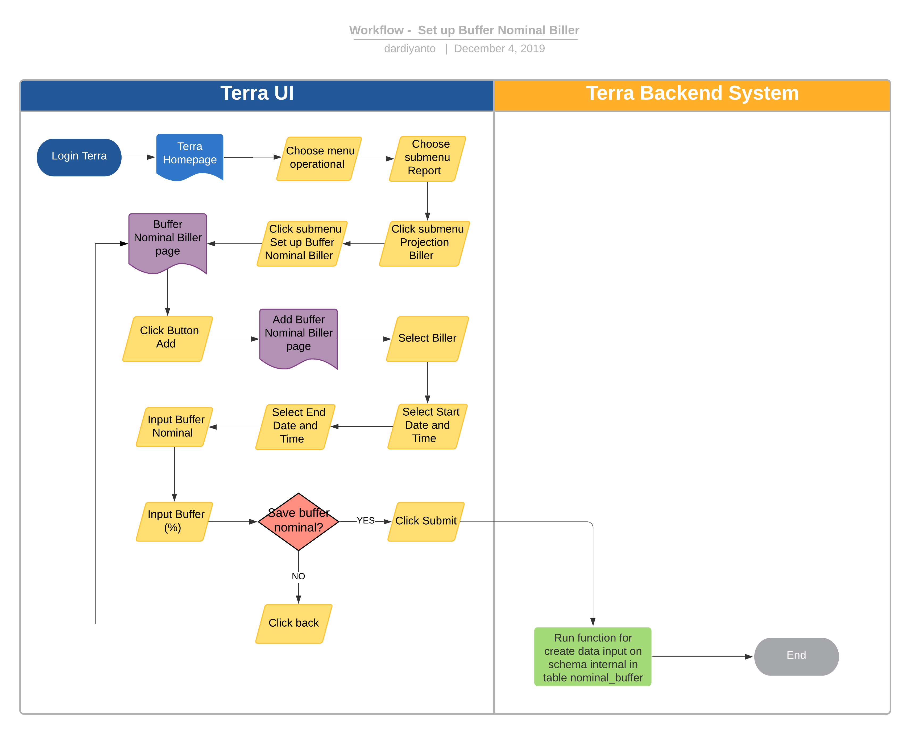

= Set up Buffer Nominal Biller Terra

== Overview

Set up Buffer Nominal Biller adalah sebuah fitur di terra yang digunakan untuk set up buffer pada spesifik biller untuk kebutuhan penghitungan projection biller.
Buffer ini biasanya di tentukan oleh team OPS berdasarkan estimasi trend dari transaksi sebelumnya.

== User Story

|===
| Nama | Actor| Business Problem | Goal 

| Set up Buffer Nominal Biller 
| OPS
| OPS ingin bisa mengontrol dan update buffer nominal biller untuk kebutuhan projection biller
| Manage and update buffer nominal and buffer percentage
|===

== Development Team

|===
| Position | Tim | Nama

| Product Owner
| Saiyo
| Bayu Setiawan

| Lead Data Engineer
| Saiyo
| Bayu Setiawan

| Data Engineer
| Saiyo
| Vera Rusmalawati

| System Analyst
|
|

| Quality engineer
|
|
|===

== Required Database and Table

Airavata Postgree

|===
| Schema | Table | Description

| internal
| buffer_nominal
| Menyimpan data setup buffer nominal biller

|===

== High Level Diagram

image::../images-terra/terra-Diagram_-_Merge_Biller.png[Diagram Merge Biller]

== Workflow System

Fitur Set up Buffer Nominal Biller

*Frontend process :*

. Login Terra
. Choose menu _'Operational'_
. Choose submenu _'Report'_
. Click sub menu _'Projection Biller'_
. Click submenu _'Set up Buffer Nominal Biller'_
. Click Button _'ADD'_ untuk add new buffer biller configuration
. Select _'Biller'_
. Select _'Start Date and Time'_
. Select _'End Date and Time'_
. Input _'Buffer Nominal'_
. Input _'Buffer Persen (%)'_
. Click _'Submit'_

*Backend process :*

. Pada saat user klik sub menu _Set up Buffer Nominal Biller_ maka akan mentrigger function untuk select and show data buffer biller yang sudah di setup sebelumnya pada UI terra.
. Selanjutnya ketika user selesai input filter parameter dan klik submit maka akan mentriggered function untuk men-create row data baru pada table _buffer_nominal_ schema _internal_ di datalake postgre airavata.
