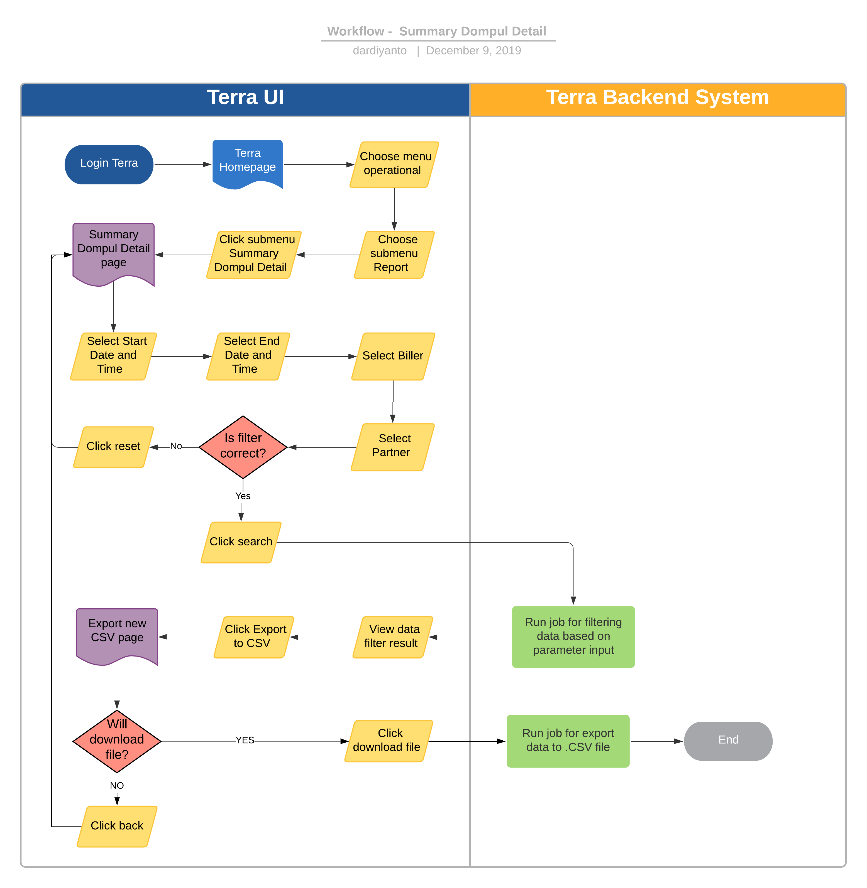

= Summmary Dompul Detail Terra

== Overview

Fitur ini digunakan untuk mengetahui detail summary dompul untuk masing-masing label dompul dalam range date tertentu, satu dompul code bisa digunakan oleh lebih dari 1 partner.
Dalam report ini kita bisa mengetahui kuota dompul untuk masing-masing partner dalam dompul code yang sama.
Baik itu kuota mobile maupun data.
Berikut detail informasi yang ada pada report Summary Dompul Detail :

* Month of Created
* Month
* Week of Created
* Partner Name
* Partner Type
* Product Type
* product ID
* Product Name
* Biller
* Transaction Count
* New Seller Price
* New Purchase Price
* Margin
* Message
* Dompul

== User Story

|===
| Nama | Actor| Business Problem | Goal

|Summary Dompul 
| OPS
| Team OPS kesulitan untuk tracking dan monitoring kuota dompul per dompul code dan di breakdown per partner.
Alangkah lebih efisien apabila bisa di _automate_
| Dapat melakukan _tracking_ dan _monitoring_ detail kuota dompul per-partner
|===

== Development Team

|===
| Position | Tim | Nama

| Product Owner
| Saiyo
| Bayu Setiawan

| Lead Data Engineer
| Saiyo
| Bayu Setiawan

| Data Engineer
| Saiyo
| Vera Rusmalawati

| System Analyst
|
|

| Quality engineer
|
|
|===

== Required Database and Table

Airavata Postgree 

|===
| Scheema | Table | Description

| Datawarehouse 
| fact_bpa_biller_transaction
|

| Datawarehouse 
| fact_bpa_partner_transaction 
|

| Krakenv2 
| vw_product
|

| Krakenv2 
| vw_partner 
|

| Krakenv2 
| transaction 
|

| Internal 
| Dompul 
|
|===

== High Level Diagram

image::../images-terra/terra-Diagram_-_Merge_Biller.png[Diagram Merge Biller]

== Workflow System

Fitur Summary Dompul Detail

*Frontend process :*

. Login Terra
. Choose menu _'Operational'_
. Choose submenu _'Report'_
. Click submenu _'Summary Dompul Detail'_
. Select _'Start Date and Time (Created Date)'_
. Select _'End Date and Time (Created Date)'_
. Select _'Biller'_
. Select _'Partner'_
. Click _'Search'_
. Click _'Export to CSV'_
. Click link _'Download File'_

*Backend process :*

. Ketika user selesai input filter parameter dan klik submit maka akan mentriggered function untuk mengexecute data based on filter parameter lalu di show pada page  di terra,
 ** Pertama function tersebut akan menjalankan sejumlah fungsi sum guna mendapatkan total purchased_price dengan tipe product_type mobile dan data baik dari transaksi di krakenv1, krakenlite dan krakenv2 dangan range date based on parameter input.
sebagai source datanya menggunakan table _fact_bpa_biller_transaction_ dan _fact_bpa_partner_transaction_ pada schema _datawarehouse_ di datalake airavata
 ** Selanjutnya dari transaksi tersebut akan di join ke table _dompul_ schema _internal_ untuk mapping transaksi-transaksi tersebut masuk ke dalam dompul code dan dompul label apa dan akan di breakdown per partner.
Setelah data set yang di inginkan sudah sesuai dengan parameter input maka akan di show pada databales di UI Terra.
. Ketika user klik button export to CSV maka backend system terra akan menjalankan function untuk export data menjadi CSV file dan akan di arahkan ke _export new CSV page._
. Ketika user klik link download maka file .CSV akan di unduh ke device user
