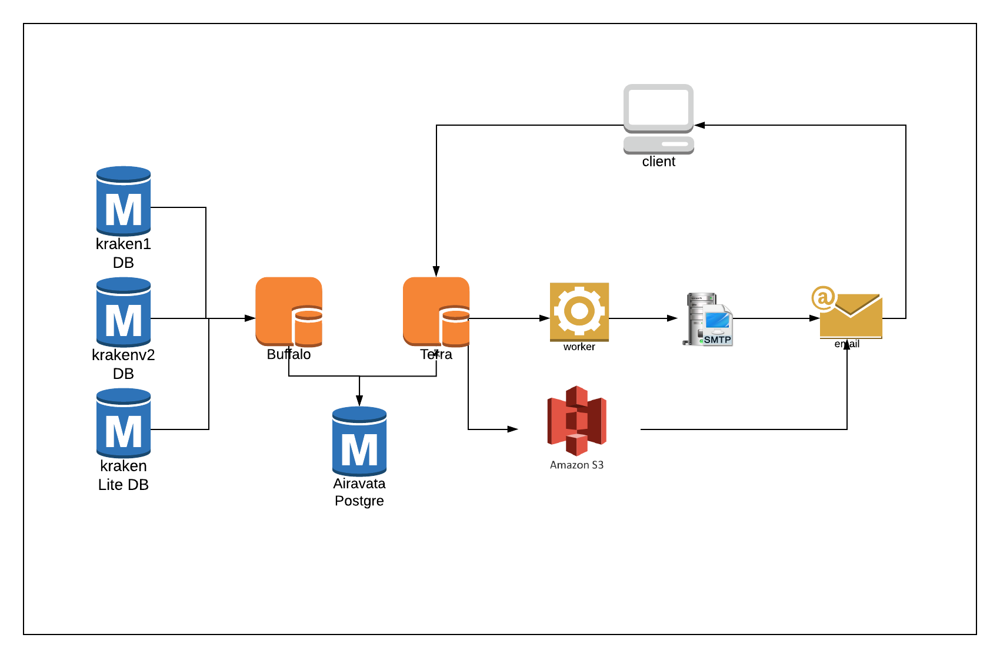

= Summary Dompul Partner Terra

== Overview

Fitur ini digunakan untuk mengetahui summary dompul dari masing-masing partner dan count transaksi serta margin dalam range date tertentu.
Berikut beberapa informasi yang ada dalam report Summary Dompul Partner :

* Dompul Code
* Dompul Label
* Partner
* Mobile
* Data
* Total

== User Story

|===
| Nama | Actor| Business Problem | Goal 

| Summary Dompul Partner 
| OPS
| OPS kesulitan untuk tracking dompul per partner serta margin dan jumlah transaksi nya dalam range date tertentu| Mampu melakukan tracking dan mengontrol Dompul partner dalam setiap periode 

|===

== Development Team

|===
| Position | Tim | Nama

| Product Owner
| Saiyo
| Bayu Setiawan

| Lead Data Engineer
| Saiyo
| Bayu Setiawan

| Data Engineer
| Saiyo
| Vera Rusmalawati

| System Analyst
|
|

| Quality engineer
|
|
|===

== Required Database and Table

Airavata Postgree

|=== 
| Schema | Table | Description 

| Public 
| Kraken_trx 
|

| Public 
| Kraken_fields 
|

| Public 
| Kraken_Billers 
|

| Public 
| Product 
|

| Krakenv2 
| Transactions 
| 

| Krakenv2 
| Transaction_Biller 
|

| Krakenv2 
| vw_product 
|

| Kraken_lite 
| Kraken_trx 
|

| Kraken_lite 
| Kraken_biller 
|

| Kraken_lite 
| Product 
|

| Internal 
| Dompul 
|

|===

== High Level Diagram

== Workflow System

Fitur Summary Dompul Partner

*Frontend process :*

. Login Terra
. Choose menu _'Operational'_
. Choose submenu _'Report'_
. Click submenu _'Summary Dompul Partner_
. Select _'Start Date and Time (Created Date)'_
. Select _'End Date and time (Created Date)'_
. Select _'Biller'_
. Select _'Partner'_
. Click _'Search'_
. Click _'Export to CSV'_
. Click link _'Download File'_

*Backend process :*

. Ketika _User_ selesai input filter parameter dan klik submit maka akan mentriggered function untuk mengexecute data based on filter parameter lalu di show pada page  di terra,
 ** Pertama function tersebut akan menjalankan sejumlah fungsi sum guna mendapatkan total purchased_price dan total sell price serta meng-count transaksi per product dalam date range yang sudah di tentukan.
Lalu mencari nilai margin dengan cara _total sell price_ - _total purchase price_.
Transaksi yang di aggregation bisa dengan product_type mobile dan data baik dari transaksi di krakenv1, krakenlite dan krakenv2 dangan range date based on parameter input.
sebagai source datanya menggunakan table :
+
....
     kraken1 = kraken_trx

     krakenv2 = transactions

     krakenlite = kraken_trx
....

* Selanjutnya dari transaksi tersebut akan di join ke table _dompul_ schema _internal_ untuk mapping transaksi-transaksi tersebut masuk ke dalam dompul code dan dompul label apa.
Setelah data set yang di inginkan sudah sesuai dengan parameter input maka akan di show pada databales di UI terra.

. Ketika _User_ klik button export to CSV maka backend system terra akan menjalankan function untuk export data menjadi CSV file dan akan di arahkan ke _export new CSV page._
. Ketika _User_ klik link download maka file .CSV akan di unduh ke device user
