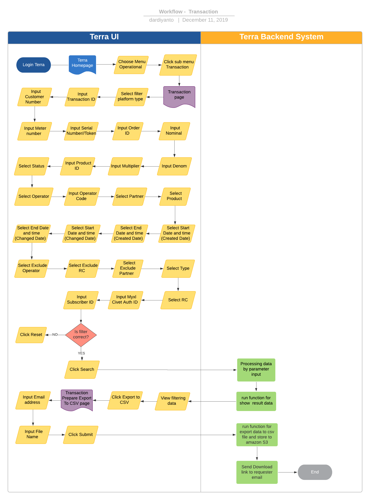

= Transaction Terra

== Overview

Transaction adalah sebuah fitur di terra yang digunakan untuk view export riwayat transaksi secara detail yang terjadi di dalam bisnis inisiatif BPA.
Transaction ini sudah mengakomodir data transaksi dari platform kraken1 dan krakenv2.
System ini digunakan untuk me-manage transaksi harian juga melihat transaksi pada range date tertentu.
Dalam report ini kita bisa melihat informasi seperti :

* Customer number
* Latency
* Status
* label product
* partner
* denom
* sell price
* order ID
* RC
* dll

== User Stories

|===
| Name | Actor | Business Problem | Goal

| Transaction
| Data Team
| Membutuhkan data untuk cek day to day transaction
| Memonitoring transaksi,mendapatkan raw data untuk based report ops dengan mudah.
|===

== Development Team

|===
| Position | Tim | Nama |

|
| Product Owner
| Saiyo
| Bayu Setiawan

|
| Lead Data Engineer
| Saiyo
| Bayu Setiawan

|
| Data Engineer
| Saiyo
|

|
| System Analyst
| Saiyo
|

|
| Quality engineer
|
|
|===

== Required Database and Table

Airavata Postgree
 
|===
| Schema | Table | Description

| Public
| kraken_trxAC
| Menyimpan detail data transaksi dari platform krakenv1

|
| product 
|

|
| kraken_fields
|

|
| kraken_transaction_detailed_price
|

|
| kraken_biller_detail
|

| krakenv2
| transactions
| Menyimpan detail data transaksi dari platform krakenv2 

|
| partners
|

| 
| products
|

| 
| operator
|

| 
|transaction_prices
|

|===

== High Level Diagram

image::../images-terra/terra-Diagram_-_Merge_Biller.png[Diagram Merge Biller]

== Workflow System

Fitur Transaction

*Frontend process :*

. Login Terra
. Choose menu _'Operational'_
. Click sub menu _'Transaction'_
. Select filter _'Platform Type'_ (*mandatory)
. Input _Transaction ID_
. Input _Customer Number_
. Input _Meter Number_
. Input _Serial Number/Token_
. Input _Order ID_
. Input _Nominal_
. Input _Denom_
. Input _Multiplier_
. Input _Product ID_
. Select _'Status'_
. Select filter _'Operator'_
. Input _Operator Code_
. Select _'Partner'_
. Select _'Product'_
. Select _'Start Date and Time'_ (created date)
. Select _'End Date and Time'_ (created date)
. Select _'Start Date and Time'_ (changed date)
. Select _'End Date and Time'_ (changed date)
. Select _'Exclude Operator'_
. Select _'Exclude RC'_
. Select _'Exclude Partner'_
. Select _'Type'_
. Select _'RC'_
. Input _Myxl Civet Auth ID_
. Fill _Subscriber ID_
. Click _'Search'_
. Click _'Export to CSV'_
. Input email address
. Click _'Submit'_

*Backend process :*

. Ketika user selesai input filter parameter dan klik submit maka akan mentriggered function untuk menjalankan sejumlah fungsi select dan join data based on filter parameter lalu di show pada page transaction di UI terra, sebagai source datanya untuk transaksi dari platform krakenv1 menggunakan table _transaction_trx_,  _products, kraken_fields_ dan _kraken_transaction_detailed_price_ pada schema _public_.
Sedangka untuk transaksi dari platform krakenv2 menggunakan table _transactions, partner, product, operator_ dari schema _krakenv2_ di datalake airavata.
. Setelah view data di terra based on filter parameter user bisa export data dengan cara klik button export to CSV lalu oleh backend system terra akan di arahkan ke page _Transaction prepare Export to CSV._
. Pada page _Transaction prepare Export to CSV_ user harus input alamat email pribadi dan file name__,__ ketika user klik submit maka data tersebut akan di transform dalam bentuk .CSV dan akan di store ke amazon S3.
. Lalu link download file nya akan dikirimkan sesuai dengan alamat email yang di input (Email yang dikirimkan report ada validasi dan hanya bisa menggunakan email @alterra.co.id atau @sepulsa.com)
