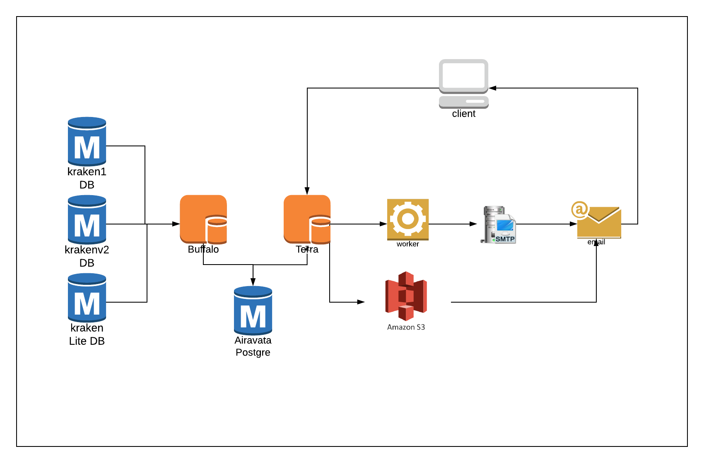
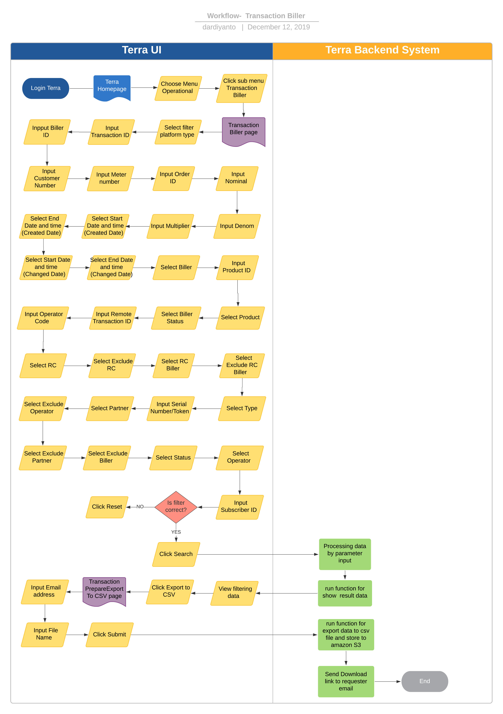

= Transaction Biller Terra

== Overview

Transaction Biller adalah sebuah fitur di terra yang digunakan untuk view export riwayat transaksi dari alterra ke biller secara detail yang terjadi di dalam bisnis inisiatif BPA.
Transaction ini sudah mengakomodir data transaksi dari platform kraken1 dan krakenv2 serta response message dan status transaksi dari biller.
System ini digunakan untuk me-manage transaksi harian juga melihat transaksi pada range date tertentu.
Dalam report ini kita bisa melihat informasi seperti :

* Customer number
* Total Latency
* Status
* label product
* partner
* denom
* sell price
* order ID
* biller
* message Biller
* RC Biller
* purchase price
* biller status
* dll

== User Stories

|===
| Name | Actor | Business Problem | Goal

| Transaction Biller
| Data Team
| Membutuhkan data untuk cek day to day transaction dari Alterra ke Biller
| Memonitoring transaksi,mendapatkan raw data transaksi dari alterra ke biller untuk kebutuhan report ops dengan mudah.
|===

== Development Team

|===
| Position | Tim | Nama |

|
| Product Owner
| Saiyo
| Bayu Setiawan

|
| Lead Data Engineer
| Saiyo
| Bayu Setiawan

|
| Data Engineer
| Saiyo
|

|
| System Analyst
| Saiyo
|

|
| Quality engineer
|
|
|===

== Required Database and Table

Airavata Postgree

|===
| Schema | Table | Description

| Public
| Kraken_trx
| Menyimpan detail data transaksi dari platform krakenv1

|
| Product
|

|
| kraken_fields
|

|
| Kraken_Biller
|

|
| Kraken_Biller_Detail
|

|
| Kraken_tansaction_detailed_price
|

| Kraken V2
| Transaction
| Menyimpan detail data transaksi dari platform krakenv2

|
| Partners
|

|
| Products
|

|
| Product_Types
|

|
| Operator
|

|
| Biller
|

|
| Transaction_Prices
|

|
| Transaction_Billers
|
|===

== High Level Diagram

== Workflow System

Fitur Transaction Biller

*Frontend process :*

. Login Terra
. Choose menu _Operational_
. Click sub menu _Transaction Biller_
. Select filter _Platform Type_ (*mandatory)
. Input _Transaction ID_
. Input _Biller ID_
. Input _Customer Number_
. Input Meter Number
. Input _Order ID_
. Input _Nominal_
. Input Denom
. Input Multiplier
. Select start date and time (created date)
. Select end date and time (created date)
. Select start date and time (changed date)
. Select end date and time (changed date)
. Select Biller
. Input _Product ID_
. Select Product (*Mandatory)
. Select Biller Status
. Input Remote transaction ID
. Input Operator Code
. Select RC
. Select Exclude RC
. Select RC Biller
. Select exclude RC Biller
. Select Type
. Input Serial Number/Token
. Select Partner
. Select Exclude Operator
. Select Exclude Partner
. Select Exclude Biller
. Select Status
. Select Operator
. Input Subscriber ID
. Click Search
. Click Export to CSV
. Input email address
. Click Submit

*Backend process :*

. Ketika user selesai input filter parameter dan klik submit maka akan mentriggered function untuk menjalankan sejumlah fungsi select dan join data based on filter parameter lalu di show pada page transaction di UI terra, sebagai source datanya untuk transaksi dari platform krakenv1 menggunakan table _transaction_trx_,  _products, kraken_fields_ dan _kraken_transaction_detailed_price_ pada schema _public_.
Sedangkan untuk transaksi dari platform krakenv2 menggunakan table _transactions, partner, product, product_type, operator, transaction_prices, transaction_billers_ dari schema _krakenv2_ di datalake airavata.
. Setelah view data di terra based on filter parameter user bisa export data dengan cara klik button export to CSV lalu oleh backend system terra akan di arahkan ke page _Transaction prepare Export to CSV._
. Pada page _Transaction prepare Export to CSV_ user harus input alamat email pribadi dan file name__,__ ketika user klik submit maka data tersebut akan di transform dalam bentuk .CSV dan akan di store ke amazon S3.
Alamat email yang di input bisa multiple dengan separator koma(,).
. Lalu link download file nya akan dikirimkan sesuai dengan alamat email yang di input (Email yang dikirimkan report ada validasi dan hanya bisa menggunakan email @alterra.co.id atau @sepulsa.com)
