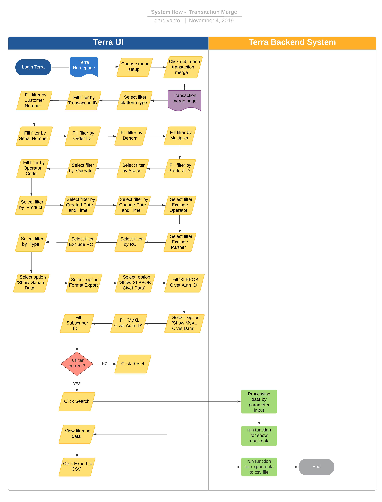

= Transaction Merge Terra

== Overview

Transaction Merge adalah sebuah fitur di dalam Terra yang digunakan untuk _view export_ riwayat transaksi yang terjadi di dalam bisnis inisiatif BPA.
Transaction Merge ini sudah mampu mengakomodir data transaksi dari platform kraken1, krakenv2, dan krakenlite.
System ini selain digunakan untuk me-_manage_ transaksi harian juga digunakan tim Ops untuk memenuhi kebutuhan _reporting_ yang diminta oleh partner dan biller.

== User Stories

|===
| Nama | Actor | Business Problem | Goal

| _Transaction Merge_
| Tim Data
| Membutuhkan data mentah untuk cek _historical transaction_
| Me-_monitor_ transaksi, mendapatkan data mentah untuk _based report_ Ops dengan mudah
|===

== Development Team

|===
| Position | Tim | Nama |

|
| Product Owner
| Saiyo
| Bayu Setiawan

|
| Lead Data Engineer
| Saiyo
| Bayu Setiawan

|
| Data Engineer
| Saiyo
|

|
| System Analyst
| Saiyo
|

|
| Quality engineer
|
|
|===

== Required Database and Table

*Airavata Postgree*

|===
| Schema | Table | Descriptions

| Kraken V2
| transactions_flash
| Menyimpan detail data transaksi dari beberapa platform (kraken1, krakenv2, krakenlite) untuk kebutuhan _reporting_
|===

== High Level Diagram

Berikut diagram arsitektur dari fitur ini:

image::../images-terra/terra-Diagram_-_Merge_Biller.png[Diagram Merge Biller]

== Workflow System

Berikut merupakan _workflow_ dari fitur _merge biller_:

*Frontend process :*

. Login ke Terra
. Pilih menu _setup_ > klik submenu _transaction merge_
. Pilih filter _'`Platform Type`'_ (*mandatory)
. Isilah filter _'`Transaction ID`'_
. Isilah filter _'`Customer Number`'_
. Isilah filter _'`Serial Number`'_
. Isilah filter _by Order ID_
. Isilah filter _by Denom_
. Isilah filter _by Multiplier_ ( For postpaid transaction ; PLN, BPJS, etc)
. Isilah filter _by Product ID_
. Pilih filter _by Status_
. Pilih filter _by Operator_
. Isilah filter _by Operator Code_
. Pilih filter _by Product_
. Pilih filter _by Created Date and Time_
. Pilih filter _by Change Date and Time_
. Pilih filter _Exclude Operator_
. Pilih filter _Exclude Partner_
. Pilih filter _by RC_
. Pilih filter _Exclude RC_
. Pilih filter _by Type_
. Pilih opsi _'Show Gaharu Data'_
. Pilih opsi _Format Export_
. Pilih opsi _'Show XLPPOB Civet Data'_
. Isilah _'XLPPOB Civet Auth ID'_
. Pilih opsi _'Show MyXL Civet Data'_
. Isilah _'MyXL Civet Auth ID'_
. Isilah _'Subscriber ID'_
. Klik _Search_
. Klik _Export to CSV_
. Input alamat email

*Backend process :*

. Ketika user selesai input filter parameter dan klik _submit_ maka akan men-_triggered_ fungsi untuk melakukan _execute_ data berdasarkan filter parameter lalu di-_show_ pada halaman '`transaction_merge`' di Terra, sebagai _source data_-nya menggunakan tabel "`transactions_flash`" karena tabel tersebut merupakan hasil _join_ transaksi dari 3 _schema_, yaitu: Kraken1, Krakenv2, dan Krakenlite.
. Setelah data bisa di-_view_ di Terra berdasarkan filter parameter, maka akan muncul tombol _Export to CSV_ dan label untuk input alamat email yang akan dikirimkan output _transaction merge report_, bila tombol tersebut diklik,  akan men-_triggered_ fungsi untuk menjalankan beberapa _task_:
 ** Membagi jumlah data yang akan di export ke dalam beberapa queue dengan beberapa _rule condition_: Bila _parameter date_ yang diinput lebih dari 2 minggu, akan menjalankan task _operational_transaction_merge_high_queue_.
Bila _parameter date range_ yang diinput kurang dari 2 minggu, akan menjalankan task _operational_transaction_merge_queue._
 ** _queue range date_-nya di-_limit_ 1 queue= 10 menit data transaksi, jadi semisal kita memfilter data transaksi _by date_ untuk 1 hari maka pembagian _queue_-nya adalah:

+
1 jam = 60menit
+
60 menit = 6 queue
+
6 x 24 jam = 144 queue

* Menjalankan _queue_ dan memasukkannya di CSV file dengan limit 1 juta _row_ per file dan akan membuat file baru bila sudah mencapai 1 juta _row_, fungsi ini akan membaca data apabila akan sampai pada data _export_ terakhir, maka akan memproses _flagging last_-nya di-_update_ menjadi angka 1, menandakan untuk tidak memproses _queue_ lagi.
* Kemudian file2 tersebut akan di ZIP dan disimpan pada storage amazon S3, dan link nya akan dikirimkan ke email yang di input saat submit export report to CSV.
* Fie2 yang ada di amazon S3 storage ini sifatnya temporary selama 1x24 jam karena akan ada cron yg berjalan untuk clear cache di S3.
* Untuk setiap report yg di _submit_ ada limit 1 jam per _request_, bila lebih dari 1 jam maka akan di-_terminate_ secara otomatis oleh sistem.
* Email yang dikirimkan _report_ ada validasi dan hanya bisa menggunakan email @alterra.co.id atau @sepulsa.com
