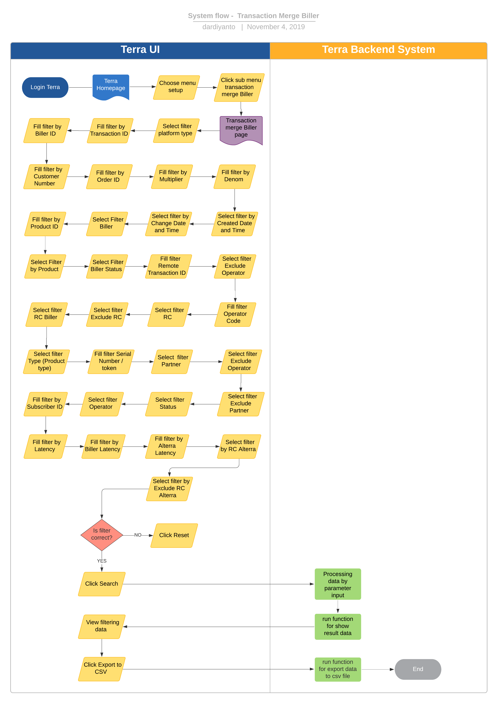

= Transaction Merge Biller Terra

== Overview

Transaction Merge Biller adalah sebuah fitur di terra yang digunakan untuk view export riwayat transaksi yang terjadi di dalam bisnis inisiatif BPA, khususnya informasi terkait dengan biller.
Transaction merge ini sudah mengakomodir data transaksi dari platform kraken1, krakenv2 dan krakenlite.
System ini selain digunakan untuk me-manage transaksi harian juga digunakan team ops untuk memenuhi kebutuhan reporting yang diminta oleh partner dan biller.

== User Stories

|===
| Nama | Actor | Business Problem | Goal

| _Transaction Merge Biller_
| Tim Data
| Membutuhkan data mentah untuk cek _historical transaction_
| Memonitoring transaksi,mendapatkan raw data untuk based report ops dengan mudah.
|===

== Development Team

|===
| Position | Tim | Nama |

|
| Product Owner
| Saiyo
| Bayu Setiawan

|
| Lead Data Engineer
| Saiyo
| Bayu Setiawan

|
| Data Engineer
| Saiyo
|

|
| System Analyst
| Saiyo
|

|
| Quality engineer
|
|
|===

== Required Database and Table

*Airavata Postgree*

|===
| Schema | Table | Descriptions

| Kraken V2
| transactions_flash
| Menyimpan detail data transaksi dari beberapa platform (kraken1, krakenv2, krakenlite) untuk kebutuhan _reporting_

| Kraken V2
| Transaction_biller_flash
| Menyimpan detail informasi transaksi mengenai biller untuk kebutuhan reporting
|===

== High Level Diagram

Berikut diagram arsitektur dari fitur ini:

image::../images-terra/terra-Diagram_-_Merge_Biller.png[Diagram]

== Workflow System

[discrete]
=== Fitur Transaction Merge Biller

*Frontend process :*

. Login Terra
. Choose menu setup > click sub menu '`transaction merge biller`'
. Select filter '`Platform Type`' (*mandatory)
. Fill filter '`Transaction ID`'
. Fill filter '`Customer Number`'
. Fill filter by Biller ID
. Fill filter by Customer Number
. Fill filter by Order ID
. Fill filter by Multiplier
. Fill filter by Denom
. Select filter by Created Date and Time
. Select filter by Change Date and Time
. Select Filter Biller
. Fill filter by Product ID
. Select Filter by Product
. Select Filter Biller Status
. Fill filter Remote Transaction ID
. Select filter Exclude Operator
. Fill filter Operator Code
. Select filter RC
. Select filter Exclude RC
. Select filter RC Biller
. Select filter Type (Product type)
. Fill filter Serial Number / token
. Select filter Partner
. Select filter Exclude Operator
. Select filter Exclude Partner
. Select filter Status
. Select filter Operator
. Fill filter by Subscriber ID
. Fill filter by Latency
. Fill filter by Biller Latency
. Fill filter by Alterra Latency
. Select filter by RC Alterra
. Select filter by Exclude RC Alterra
. Click Search
. Fill email address
. Click export to CSV

*Backend process :*

. Ketika user selesai input filter parameter dan klik submit maka akan mentriggered function untuk mengexecute data based on filter parameter lalu di show pada page '`transaction_merge`' di terra, sebagai source data transaksi nya menggunakan table "`transactions_flash`" yang akan di joinkan dengan table "`transactions_biller_flash`" karena table tersebut sudah mencakup data dari 3 schema yaitu : kraken1, krakenv2, dan krakenlite dan dibuat untuk keperluan reporting.
. Setelah data bisa di view di terra based on filter parameter maka akan muncul button export to CSV dan label untuk input alamat email yang akan dikirimkan output transaction merge report, bila button tersebut di klik maka akan men-triggered function untuk menjalankan beberapa task :
 ** Membagi jumlah data yang akan di export ke dalam beberapa queue dengan beberapa rule condition : Bila parameter date yang di input lebih dari 2 minggu maka akan menjalankan task _operational_transaction_merge_high_queue_.
Bila parameter date range yang di input kurang dari 2 minggu maka akan menjalankan task _operational_transaction_merge_queue._
 ** queue range date nya di limit 1 queue = 10 menit data transaksi, jadi semisal kita memfilter data transaksi by date untuk 1 hari maka pembagian queue nya adalah:

+
1 jam = 60menit
+
60 menit = 6 queue
+
6 x 24 jam = 144 queue

* Menjalankan queue dan menginsert di CSV file dengan limit 1jt row per file dan akan membuat file baru bila sudah mencapai 1jt row, function ini akan membaca data apabila akan sampai pada data export terkhir maka akan memproses flagging last nya di update menjadi angka 1, menandakan untuk tidak memproses queue lagi.
* Kemudian file2 tersebut akan di ZIP dan disimpan pada storage amazon S3, dan link nya akan dikirimkan ke email yang di input saat submit export report to CSV.
* Fie2 yang ada di amazon S3 storage ini sifatnya temporary selama 1x24 jam karena akan ada cron yg berjalan untuk clear cache di S3.
* Untuk setiap report yg di submit ada limit 1 jam per request, bila lebih dari 1 jam maka akan di terminate secara otomatis oleh system.
* Email yang dikirimkan report ada validasi dan hanya bisa menggunakan email @alterra.co.id atau @sepulsa.com
