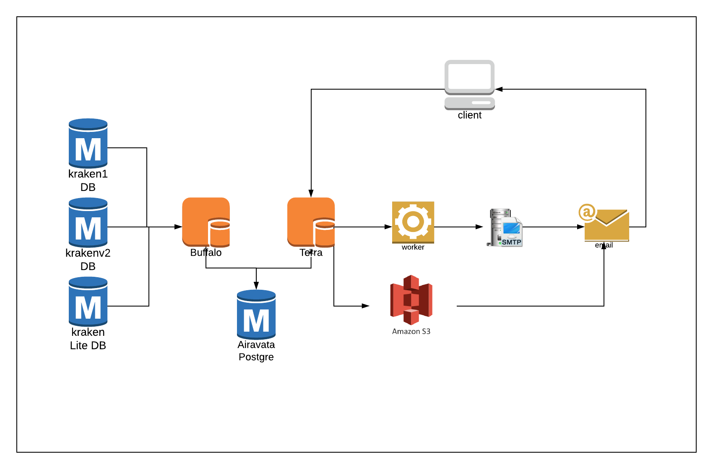
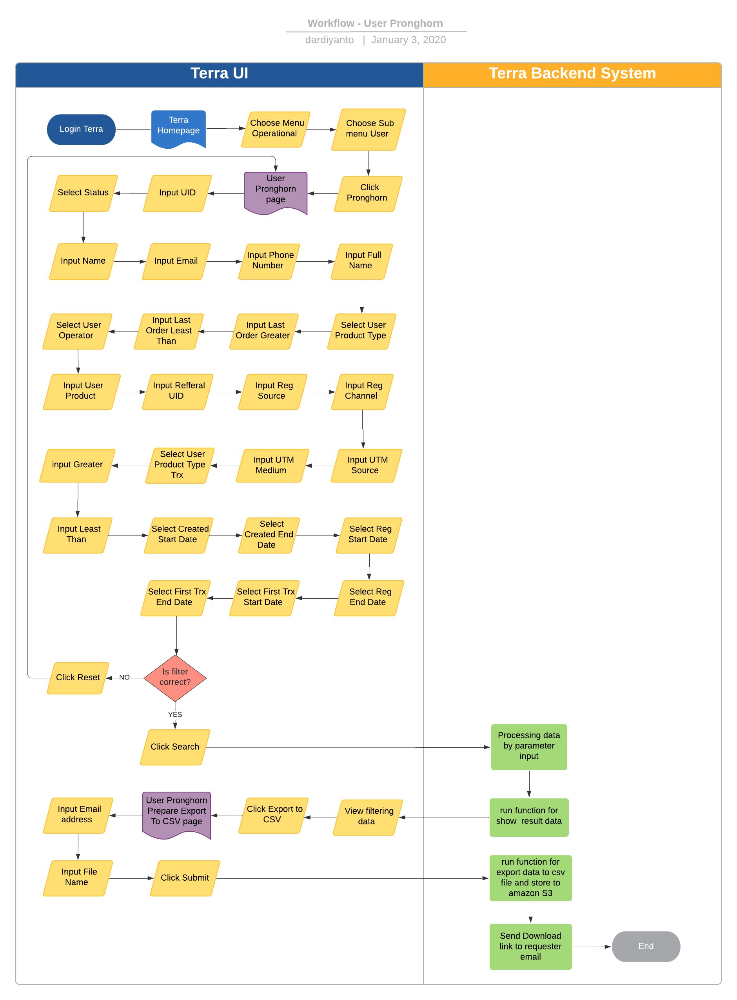

= User - Pronghorn User List

== Overview

Pronghorn User List adalah salah satu fitur reporting di terra yang digunakan untuk mendapatkan data dan informasi terkait user pronghorn mulai dari first transaction, status user dan registration date user, dll yang nantinya akan digunakan sebagai data insight team marketing dll.
Beberapa informasi yang ada dalam report ini antara lain :

. UID
. Name
. Email
. Full Name
. Phone Number
. Created
. Reg Date
. First Trx Date
. Access
. Login
. Status
. Is Merged
. Uuid
. Reg Channel
. Reg UTM Source
. Reg UTM Medium
. Payment Order
. Order Operator
. Order Product
. Take Voucher
. Referral UID
. Newsletter
. Subscribers
. Registration Source

== User Stories

|===
| Nama | Actor| Business Problem | Goal

| Pronghorn User 
| OPS
| Ada kebutuhan team product dan marketing untuk mendapatkan data dan informasi terkait user untuk di analisa lebih lanjut
|Bisa mendapat data dan informasi user dalam sistem pronghorn dan di analisa menjadi insight bagi team internal

|===

== Development Team

|===
| Position | Tim | Nama

| Product Owner
| Saiyo
| Bayu Setiawan

| Lead Data Engineer
| Saiyo
| Bayu Setiawan

| Data Engineer
| Saiyo
|

| System Analyst
|
|

| Quality engineer
|
|
|===

== Required Database and Table

*Airavata Postgree*

|===
| Schema | Table | Description

| Pronghorn
| user 
|

| datawarehouse 
| fact_pronghorn_user_first_data 
|

|===

== High Level Diagram

== Workflow System

Fitur Pronghorn User List

 *Frontend process :*

. Login Terra
. Choose menu _Operational_
. Choose submenu _User_
. Click sub menu _Pronghorn_
. Input UID
. Select Status
. Input Name
. Input Email
. Input Phone Number
. Input Full Name
. Select User Product Type
. Input Last Order Greater
. Input Last Order Least Than
. Select User Operator
. Input User Product
. Input Refferal UID
. Input Reg Source
. Input Reg Channel
. Input UTM Source
. Input UTM Medium
. Select User Product Type Trx
. input Greater
. Input Least Than
. Select Created Start Date
. Select Created End Date
. Select Reg Start Date
. Select Reg End Date
. Select First Trx Start Date
. Select First Trx End Date
. Click search
. Click export to CSV
. Input email
. Click Submit

*Backend process :*

. Pada saat user klik sub menu _User - Pronghorn_ maka akan mentrigger function untuk select data user terbaru pronghorn pada table _user_ dari schema _pronghorn_ dan beberapa informasi detail lain nya dengan cara _join_ ke table _fact_pronghorn_user_first_data_ pada schema _datawarehouse_ kemudian di sort berdasarkan tanggal pembuatan user terbaru lalu di show pada data tables di page User _Pronghorn List_.
. Selanjutnya ketika user selesai input filter parameter dan klik search maka akan mentriggered function untuk mengexecute data based on filter parameter, sebagai source data user nya menggunakan table _users_ pada schema _pronghorn_ dari _datalake_ _airavata postgree_
. Setelah dataset yang kita inginkan selesai di proses maka akan di show di ui terra, next step nya user click button _export to CSV_ maka akan diteruskan ke page _User Pronghorn prepare export data to CSV._
. Pada page _User Pronghorn prepare export data to CSV_ user harus menginput alamat email pribadi alterra untuk dikirimkan link hasil export data, dilanjutkan dengan click button _submit._
. Ketika user click button _submit_ akan mentriggered function untuk menjalankan job export dataset to csv file dan akan di store di amazon S3.
Lalu dari backend system terra akan mengirim link download file ke email yang sudah di input oleh user.
