= Setup Terra

== Terra Page

https://terra.sepulsa.id/admin/setup[Setup Page]

This is for setup page like Partner Product Sell Price, Purchase Price, Identifier, Fee, Biller Fee, Partner Fee, Subsidi

  Username : **
  Password : **

*Partner Product Sell Price* https://terra.sepulsa.id/admin/setup/partner/list[Partner Page]

Click "Product Link" \=> Click "Product Sell Price Link" in any product you want setup

image::./images-terra/terra-terra-1.png[]

How To : Choose "Start Date" you want to setup sell price, fill "Sell Price" and Click Button "Add Price"

*Biller Deposit* https://terra.sepulsa.id/admin/setup/biller/list[Biller Page]

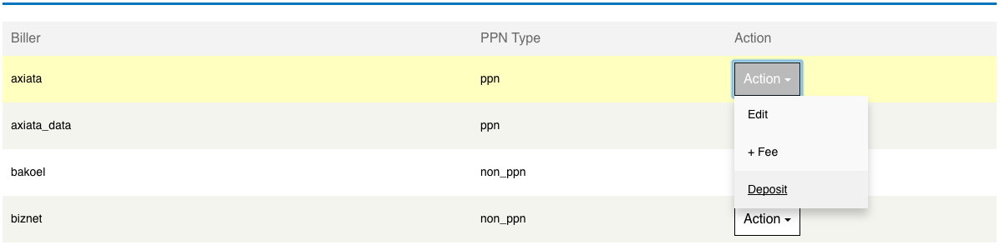

How To : Click "Action" on Biller you want to deposit to (i.e.
"axiata"), choose "Deposit"

*New Deposit* 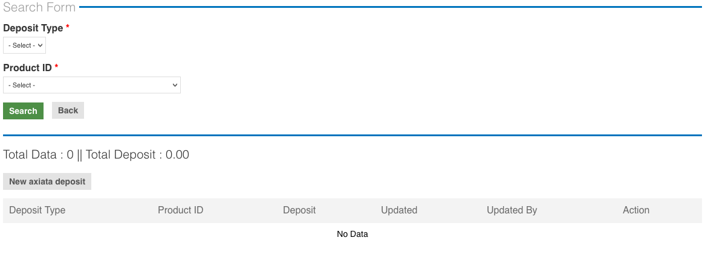

*How To* : Click "New <biller name=""> deposit" above the list table (i.e.
**New axiata deposit**)

*New Deposit Form*

*Deposit Type* : you can choose either "Amount" or "Stock"

*Product ID*: choose the product you want to deposit to, or you can choose "All"

*Deposit* : amount you want to deposit to

*Reason* : explaination about the deposit (optional) 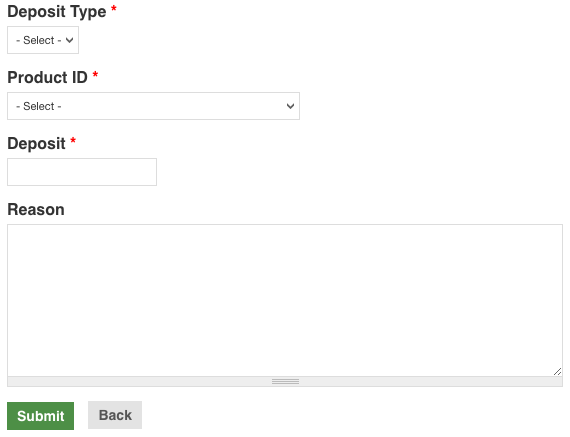

*Add Deposit*

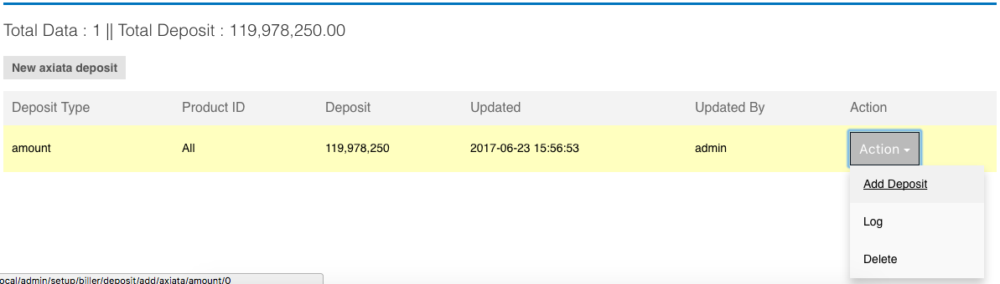

*How To* : Click "Action" choose "Add Deposit"

*Add Deposit Form*

*Deposit* : amount you want to deposit to

*Reason* : explaination about the deposit (optional) 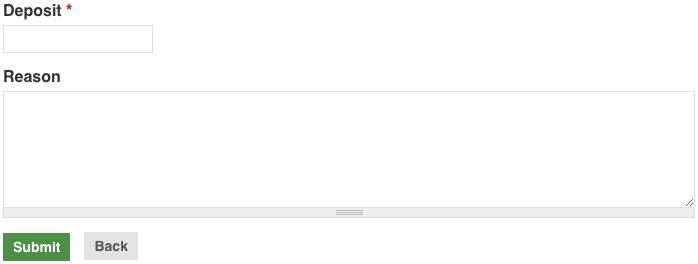

== Purchase Price

https://terra.sepulsa.id/admin/setup/product/list[Purchase Price Page]

Click "Purchase Price Button" \=> Click "+ Biller" 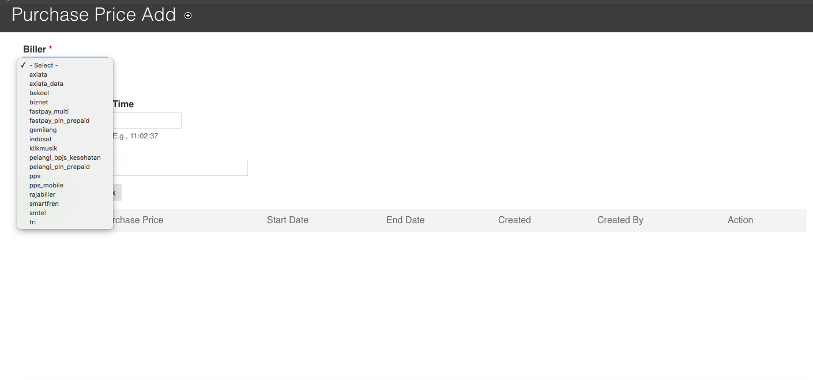

*How To* : Choose "Biller", Choose "Start Date" you want to setup Purchase Price, Fill "Purchase Price" and Click Button "Add Price"

== Identifier

https://terra.sepulsa.id/admin/setup/identifier[Identifier Page]

Click "Identifier"

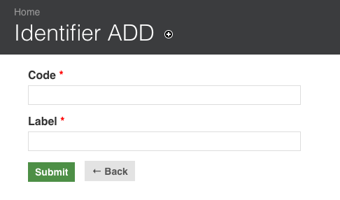

How To : Fill Code and Label, and click "Submit"

== Fee

https://terra.sepulsa.id/admin/setup/fee/list[Fee Page]

Click "Fee"

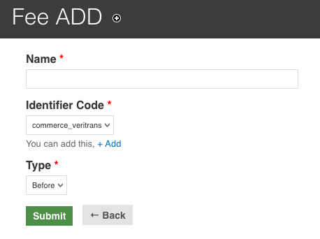

*How To* : Fill Name, Choose Identifier, Choose Type : "Before" It execute Before Process Additional Fee & "After" it execute After Process Additional Fee, and click "Submit"

*NOTE : IF no condition in Fee, please choose Identifier Code "general"*

== Biller Fee

https://terra.sepulsa.id/admin/setup/biller/list[Biller Page]

Click  "Fee" link in another Biller you want setup fee and click "+ Fee" button

*How To* : Search "Product", choose "Operator", choose "Start Date", Click "Percentage" if setup value in percent, fill "value", fill "total value" fee and click "Submit" button

== Partner Fee

https://terra.sepulsa.id/admin/setup/partner/list[Partner Page]

Click "Fee" link in another Partner you want setup fee and click "+ Fee" button

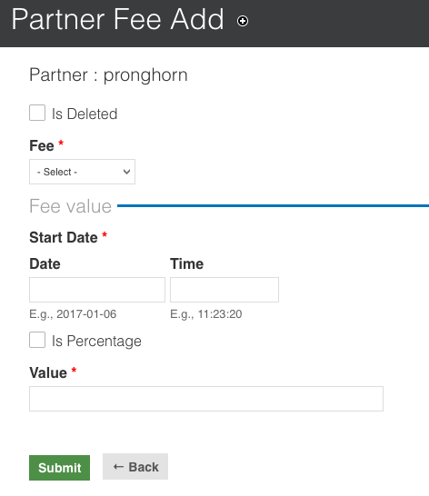

How To : Choose "Is Delete" if want to hide/soft delete Fee, choose "Fee", choose "Start Date", click "Percentage" if setup value in percent, fill "value" and click "Submit" button

== Subsidi

https://terra.sepulsa.id/admin/setup/partner/list[Partner Page]

Click "Product" link in another Partner you want setup fee and click "Subsidi" link in another product you want to setup

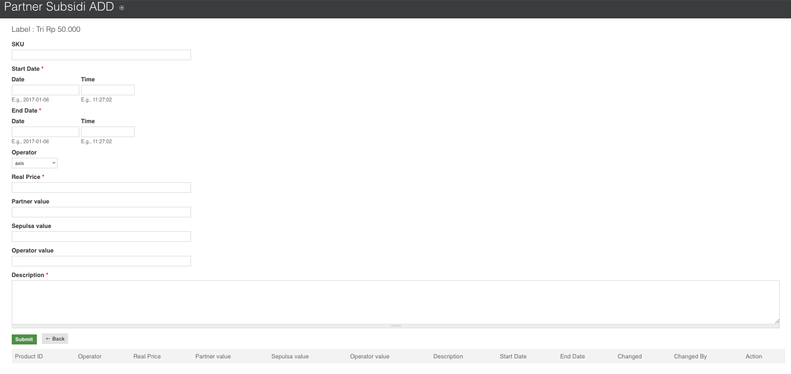

*How To* : Fill "SKU" product if any in event, Choose "Start Date", Choose "End Date", Choose "Operator" if any in event, fill "Real Price" is price product real, fill "Partner Value" if partner contibuted on this event, fill "Sepulsa Value" if sepulsa contributed in this event, fill "Operator Value" if operator contributed in this event, fill Description, and click "Submit" button.

== AR Settlement

https://terra.sepulsa.id/admin/setup/ar/settlement[AR Settlement Page]

* Click "Settlement" button to Add Settlement AR 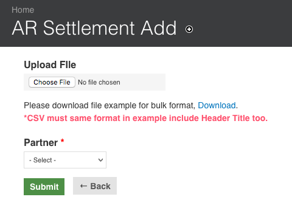

*How To* : Upload File a correct format file you can download on click link "Download", Choose "Partner", and Click "Submit" to add AR Settlement

* Click "Edit" button to Edit Settlement AR

*How To*: Upload File a correct format file you can download on click link "Download", choose "Type Edit" it's any "Insert", "Update" and "delete" action to this file, and Click "Submit" to edit AR Settlement

== AP

https://terra.sepulsa.id/admin/setup/ap[AP Page]

* Click "Purchase" button to Add Purchase AP 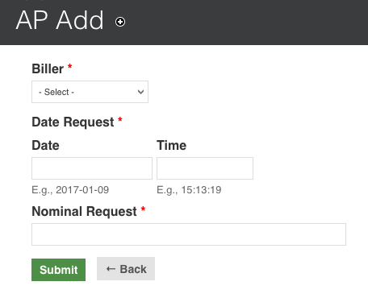

*How To* : Choose "Biller", Choose "Date Request", fill "Nominal Request", and Click "Submit" to add AP Purchase

* Click "Edit" button to Edit Purchase AP

*How To* : Choose "Date Request", fill "Nominal Request" , Choose "Date Paid", fill "Nominal Paid", and Click "Submit" to edit AP Purchase

* Click "Set Paid" button to Paid AP

*How To* : Choose "Date Paid", fill "Nominal Paid", and Click "Submit" to Set Paid AP

== Rekon Biller

https://terra.sepulsa.id/admin/setup/rekon_biller[Rekon Biller]

*Add Form*

*Biller* : select the Biller you want to add

*Title* : description of the Biller

*Start Date* : date of periode when the Biller started

*End Date*: date of periode when the Biller ended

*File* : a single .csv file with the an agreed format

*Email* : the person(s) who will receipe the report

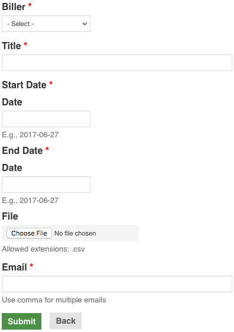

*How To* : click "Add Rekon Biller" on the Rekon Biller page

[discrete]
=== *Report*

You can filter the data on the "Filter Form".
There are six types you can filter :

Ada di kraken, tidak ada di biller

Ada di biller, tidak ada di kraken

Harga di kraken tidak sama dengan di biller

Harga di biller tidak sama dengan di kraken

Status di kraken tidak sama dengan di biller

Status di biller tidak sama dengan di kraken

You can also export the file into .csv by clicking "Export to CSV"

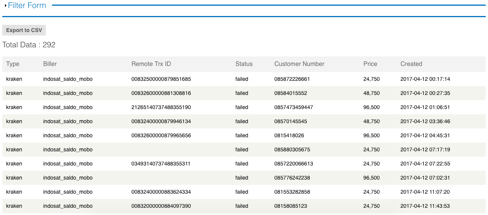

How To : https://terra.sepulsa.id/admin/setup/rekon_biller/report[Rekon Biller Report]

== Validate

The data can be validated by exporting the .csv file with an agreed format

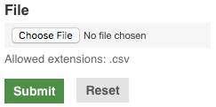

How To : https://terra.sepulsa.id/admin/setup/rekon_biller/validate[Rekon Biller Validate]
