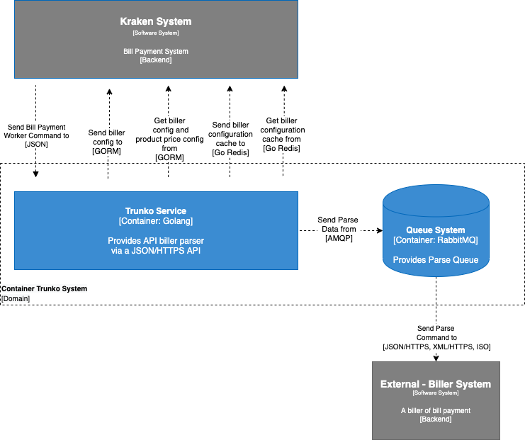

= Architecture Trunko

Berikut adalah gambar diagram C2 sistem Trunko:

Sistem ini merupakan bagian dari BPA. Untuk lebih detail terkait hubungan Trunko dengan sistem BPA lainnya, silakan mengakses <<../../../../../Divisions/Meet-Our-Divisions/Technology/Engineering/Alterra-Systems-C1-Diagram/BPA-C1-Diagram.adoc#,BPA C1 Diagram>> berikut.

== Related Systems

[cols="10%,30%,30%,30%",frame=all, grid=all]
|===
^.^h| *System Name* 
^.^h| *Description* 
^.^h| *Depends on* 
^.^h| *Be a Dependencies to*

| TRUNKO
| Biller Management
a| - Biller (External) - As Product Provider
a| - link:../Kraken/index.adoc[Kraken] - As Biller Management
|===