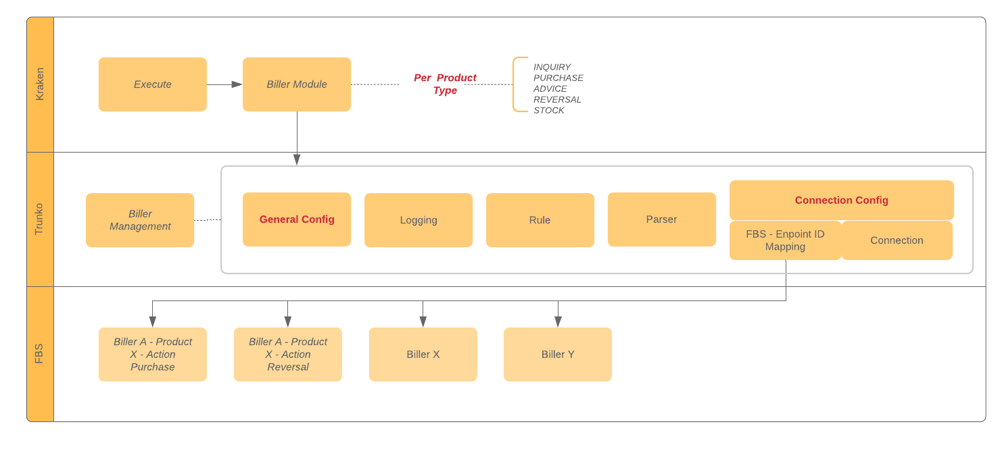

= Building Block Trunko

Trunko berperan sebagai penghubung dari Kraken ke FBS. Selain itu, Trunko juga dapat berperan sebagai _Biller Management Service_, sedangkan _Transaction state control_ masih dilakukan oleh  Kraken (yang mana berperan sebagai switcher).

Trunko terdiri atas komponen-komponen berikut:

* Biller Management
* Logger
* Rules and Parser
* Connection Configuration

