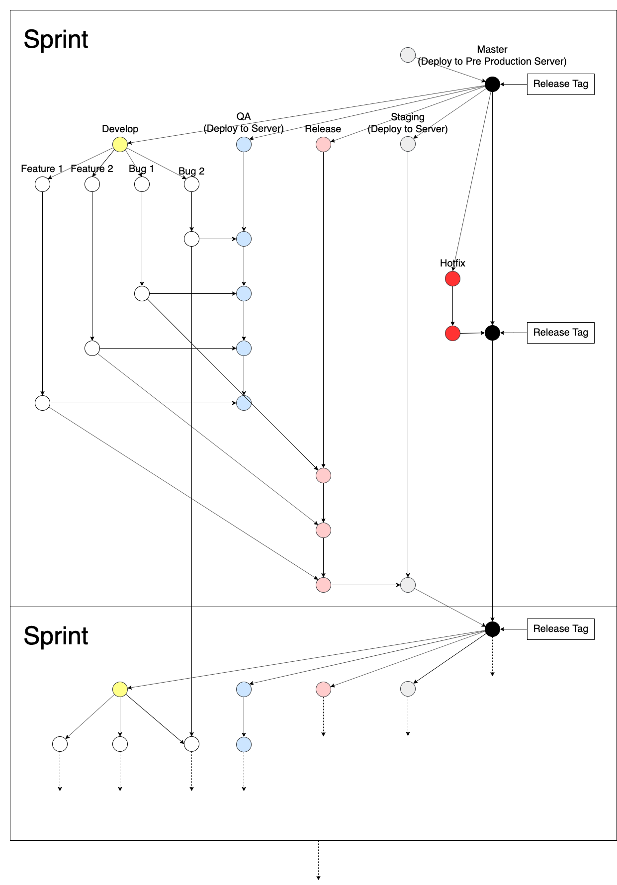

= Development Trunko

== Gitflow

== _Development Tools_

Github: https://github.com/sepulsa/trunko[Github Trunko]

Jenkins Multibranch Pipeline: https://jennie.sepulsa.id/job/Trunko/[Jenkins Trunko]

== Panduan Installasi

Anda dapat mengikuti panduan instalasi dari wiki berikut: https://github.com/sepulsa/trunko/wiki[Panduan Instalasi]

== _Development Step_

. Buat Branch baru dengan nama `<pivotal_type>/<PivotalID>-<Pivotal_Title>` dari branch **develop**
. Mulai Pivotal Story
. _Push_ branch dengan _commit message_ `[FINISH#+<PivotalID>]+<PivotalTitle>` untuk menyelesaikan story.
. Buat _Pull Request_ untuk branch *qa*
. Jika mengalami _conflict_, ikuti instruksi _Resolve Conflict Merge_ di bawah ini:
. _Accept_ _Pull Request_ dengan _message_ `[DELIVER#<PivotalID>]<PivotalTitle>`
. Periksa hasil Jenkins di https://jennie.sepulsa.id/job/Trunko/[Jenkins Trunko]

== Panduan _Resolve Conflict Merge_

JANGAN _merge_ branch *qa* ke dalam BRANCH ANDA. Jangan _resolve conflict_ dari  github, karena akan _merge_ *qa* ke dalam branch tersebut.

. _checkout_ ke _branch_ *qa*
. _git pull origin_ *qa* untuk memastikan _local branch_ ter-_update_
. _git pull origin_ `<branch to merge>`
. _git status_ untuk mengetahui file yang mengalami _conflict_
. _resolve conflict_
. _git commit_ -m `"[DELIVER#<idpivotal>]"`
. _git push origin_ *qa*
. Periksa https://github.com/sepulsa/trunko/modules/network dan pastikan tidak _commit_ "_merge_ *qa* ke dalam

== Panduan _Hotfix Development_

. Buatlah _Chore Story_ di Pivotal dengan judul "Hotfix xxx xxx xxx xxx"
. Buatlah Branch baru dengan nama `hotfix/<PivotalID>-<Pivotal_Title>` dari branch **master** yang terbaru
. _Push branch_ dengan _commit message_ `[FINISH#<PivotalID>]<PivotalTitle>` untuk menyelesaikan *story*.
. Buatlah _Pull Request_ ke branch *master*
. Jika terdapat _conflict_, silakan lakukan instruksi _Resolve Conflict Merge_ di atas ke branch *master*
. Anda dapat melakukan _Release Step_.
