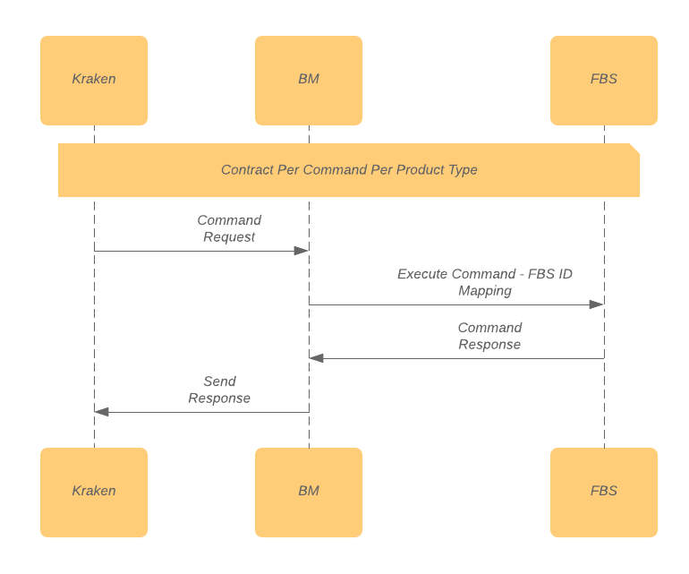

= Workflow Trunko

Di bawah adalah _sequence diagram_ yang menjelaskan bagaimana Trunko bekerja dari Kraken ke Biller (FBS).

_Use Case_ yang ideal adalah Trunko seharusnya dapat mengatur _biller transaction flow_ (bukan _Kraken Transaction flow_), _apply rules_ dan _parser_ untuk setiap _biller response_.

Berikut adalah daftar dari _Kraken Command_ yang dikirim ke Trunko

* INQUIRY
* PURCHASE
* ADVICE
* REVERSAL
* STOCK
 
 

Gambar di atas merepresentasikan workflow Trunko ke FBS. Trunko akan mengeksekusi setiap _command per product type_.