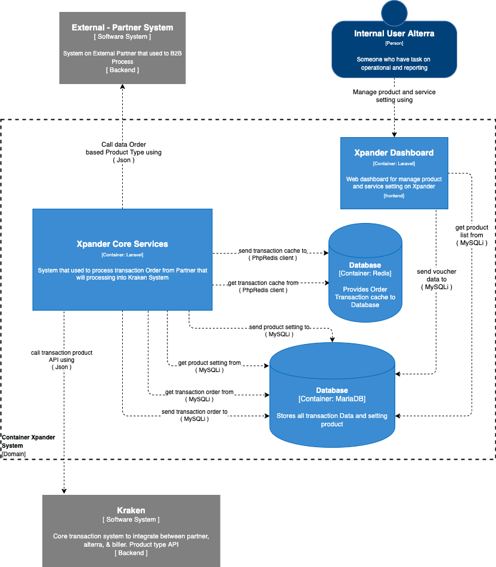

= Architecture Xpander

== High Level Architecture

Berikut adalah gambar diagram C2 sistem Xpander:

Sistem ini merupakan bagian dari Telco. Untuk lebih detail terkait hubungan Xpander dengan sistem Telco lainnya, silakan mengakses <<../../../../Divisions/Meet-Our-Divisions/Technology/Engineering/Alterra-Systems-C1-Diagram/Telco-C1-Diagram.adoc#,Telco C1 Diagram>> berikut.

== Related Systems

|===

| *System Name* | *Description* | *Depends on* | *Be a Dependencies to*

|Xpander
|System that used by indirect partner to Kraken
a|1. link:../Kraken/index.adoc[Kraken] - As Bill Payment Aggregator
2. Partner (External) - As Data Order & Product type Provider
|-

|===
