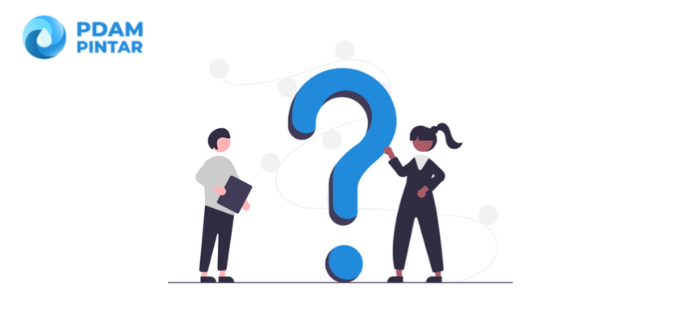

= FAQ PDAM Pintar

Hi, adakah informasi yang belum kamu dapatkan terkait PDAM Pintar? Tenang, kami sudah menyediakan FAQ yang mencakup keduabelas modulnya.

[cols="30%,70%",frame=none, grid=none]
|===

a|image::pdam-pintar-product-images/thematic-modul-akuntansi.png[align="center"]

[.text-center]
https://support.alterra.id/support/solutions/folders/67000546124[Modul Akuntansi] 

a|Pertanyaan paling sering diajukan tentang :

- Tutorial Menggunakan Modul Akuntansi
- Install aplikasi Akuntansi di komputer
- Konfigurasi serial number aplikasi
- Akuntansi di komputer

a|image::pdam-pintar-product-images/thematic-modul-bacameter.png[align="center"]

[.text-center]
https://support.alterra.id/support/solutions/folders/67000477504[Modul Bacameter]

a|Pertanyaan paling sering diajukan tentang :

- Tutorial menggunakan modul Bacameter
- Cara solving gagal upload data
- Status segel pelanggan
- Konfigurasi aplikasi

a|image::pdam-pintar-product-images/thematic-modul-billing.png[align="center"]

[.text-center]
https://support.alterra.id/support/solutions/folders/67000544120[Modul Billing]

a|Pertanyaan paling sering diajukan tentang :

- Tutorial menggunakan Modul Billing
- Aplikasi Billing tidak bisa dibuka
- Install aplikasi Billing di komputer
- Pesan error muncul ketika mengunggah data rekening
- Laporan piutang setiap 99% selalu lost connection

a|image::pdam-pintar-product-images/thematic-modul-dashboard.png[align="center"]

[.text-center]
https://support.alterra.id/support/solutions/folders/67000546127[Modul Dasbor]

a|Pertanyaan paling sering diajukan tentang :

- Tutorial Menggunakan Modul Dasbor
- Error "Gagal Memperbaharui data perasional, periksa koneksi anda"
- Data tidak muncul pada beberapa menu di Dashboard
- Tambah akses user ke Dashboard

a|image::pdam-pintar-product-images/thematic-modul-distribusi.png[align="center"]

[.text-center]
https://support.alterra.id/support/solutions/folders/67000546121[Modul Distribusi]

a|Pertanyaan paling sering diajukan tentang :

- Tutorial Menggunakan Modul Distribusi
- Install aplikasi BSHPD di komputer
- Tambah daftar petugas secara satuan atau jumlah besar (bulk)
- Data tidak muncul pada aplikasi Distribusi
- Laporan pada aplikasi Distribusi tidak bisa diakses

a|image::pdam-pintar-product-images/thematic-modul-gudang.png[align="center"]

[.text-center]
https://support.alterra.id/support/solutions/folders/67000546122[Modul Gudang]

a|Pertanyaan paling sering diajukan tentang :

- Tutorial Menggunakan Modul Gudang
- Install aplikasi Gudang di komputer
- Selisih pada laporan Gudang dan Keuangan
Bagaimana cara memperbaiki data yang berbeda pada 2 laporan di aplikasi Gudang?
- Saldo tidak sesuai dengan data laporan

a|image::pdam-pintar-product-images/thematic-modul-hublang.png[align="center"]

[.text-center]
https://support.alterra.id/support/solutions/folders/67000546119[Modul Hublang]

a|Pertanyaan paling sering diajukan tentang :

- Tutorial Menggunakan Modul Hubungan Pelanggan
- Install aplikasi BSHPD di komputer
- Error saat menambahkan permohonan sambung kembali
- Set laporan di Hublang tidak mau muncul & menyebabkan laporan error ketika dibuka di komputer klien
- Tambah petugas baca & berita acara di Hublang

a|image::pdam-pintar-product-images/thematic-modul-info-pdam.png[align="center"]

[.text-center]
https://support.alterra.id/support/solutions/folders/67000546126[Modul Info PDAM]

a|Pertanyaan paling sering diajukan tentang :

- Tutorial Menggunakan Modul Info PDAM
- Tagihan lunas masih muncul
- Tambah atau edit akses user ke PDAM Info
- Menu pada dashboard terus loading, data tidak muncul
- Foto meter di web PDAM Info tidak muncul

a|image::pdam-pintar-product-images/thematic-modul-keuangan.png[align="center"]

[.text-center]
https://support.alterra.id/support/solutions/folders/67000546125[Modul Keuangan]

a|Pertanyaan paling sering diajukan tentang :

- Tutorial Menggunakan Modul Keuangan
- Install aplikasi Keuangan di komputer
- Aplikasi Akuntansi tidak bisa dibuka
- Aplikasi Akuntansi tidak bisa dibuka karena perubahan setting serial number
- Konfigurasi serial number aplikasi Akuntansi di komputer

a|image::pdam-pintar-product-images/thematic-modul-loket.png[align="center"]

[.text-center]
https://support.alterra.id/support/solutions/folders/67000544131[Modul Loket]

a|Pertanyaan paling sering diajukan tentang :

- Tutorial Menggunakan Modul Loket
- Install aplikasi Loket di komputer
- Sebagian rekening belum muncul tampilannya di Loket
- Laporan tidak bisa dibuka di Loket
- Membatalkan transaksi di Loket

a|image::pdam-pintar-product-images/thematic-modul-perencanaan.png[align="center"]

[.text-center]
https://support.alterra.id/support/solutions/folders/67000546120[Modul Perencanaan]

a|Pertanyaan paling sering diajukan tentang :

- Tutorial Menggunakan Modul Perencanaan
- Install aplikasi BSHPD di komputer
- Tambah atau edit hak akses User perencanaan
- Pesan error muncul ketika membuka RAB sambung kembali
- Tambah PPN pada RAB

a|image::pdam-pintar-product-images/thematic-modul-personalia.png[align="center"]

[.text-center]
https://support.alterra.id/support/solutions/folders/67000546123[Modul Personalia]

a|Pertanyaan paling sering diajukan tentang :

- Tutorial Menggunakan Modul Personalia
- Install aplikasi Personalia di komputer
- Tambah atau kustom data tunjangan
- Posting data di aplikasi Personalia
- Memproses pensiun pegawai di aplikasi Personalia
|===

Jika kamu belum menemukan jawaban pertanyaanmu, atau mendapatkan kendala teknis lainnya, ajukan tiketmu ke https://support.alterra.id/support/home[Alterra Support]. Tim IT Support siap membantumu.
