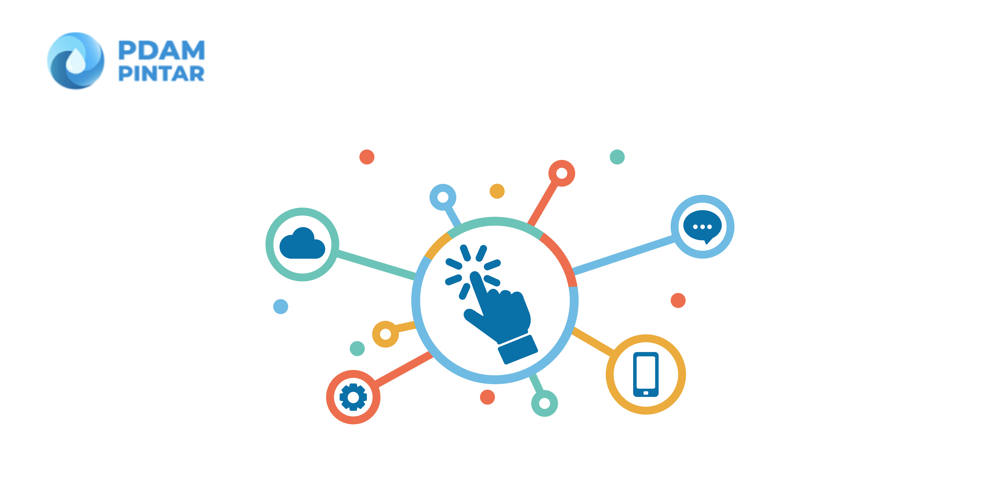

= Modul PDAM Pintar

Sistem PDAM Pintar memiliki dua belas (12) modul dengan fungsi dan fitur berbeda sesuai kebutuhan proses bisnis.

#*Apa saja modul yang ada di PDAM Pintar?*#

[cols="30%,70%",frame=none, grid=none]
|===

a|image::pdam-pintar-product-images/thematic-modul-akuntansi.png[align="center"]

[.text-center]
https://docs.alterra.id/home/kb-ho/business-initiatives/bimasakti-alterra/products/pdam-pintar/modul-akuntansi/[Modul Akuntansi] 

|Modul yang digunakan untuk melakukan pembukuan, pembuatan jurnal, memperoleh informasi pengelolaan keuangan (kas keluar dan masuk), dan penulisan laporan bulanan yang berkaitan dengan transaksi keuangan PDAM.

a|image::pdam-pintar-product-images/thematic-modul-bacameter.png[align="center"]

[.text-center]
https://docs.alterra.id/home/kb-ho/business-initiatives/bimasakti-alterra/products/pdam-pintar/modul-bacameter/[Modul Bacameter]

|Modul Bacameter digunakan untuk membaca dan melakukan verifikasi meteran PDAM. Modul ini terdiri dari dua aplikasi, yaitu Supervisi dan Sistem Kontrol

a|image::pdam-pintar-product-images/thematic-modul-billing.png[align="center"]

[.text-center]
https://docs.alterra.id/home/kb-ho/business-initiatives/bimasakti-alterra/products/pdam-pintar/modul-billing/[Modul Billing]

|Modul Billing dirancang untuk mengakomodir pembayaran Pelanggan yang meliputi pembayaran air & non air baik kolektif maupun non kolektif, histori pembayaran rekening air, serta data penerimaan dan pembatalan air & non air.

a|image::pdam-pintar-product-images/thematic-modul-dashboard.png[align="center"]

[.text-center]
https://docs.alterra.id/home/kb-ho/business-initiatives/bimasakti-alterra/products/pdam-pintar/modul-dasbor/[Modul Dasbor]
|Modul Dasbor digunakan untuk menampilkan data performa PDAM yang diambil dari data masing-masing modul.

a|image::pdam-pintar-product-images/thematic-modul-distribusi.png[align="center"]

[.text-center]
https://docs.alterra.id/home/kb-ho/business-initiatives/bimasakti-alterra/products/pdam-pintar/modul-distribusi/[Modul Distribusi]

|Modul Distribusi digunakan untuk penanganan distribusi, baik penyegelan rekening, pengelolaan air tangki, dan sebagainya pada masing-masing PDAM

a|image::pdam-pintar-product-images/thematic-modul-gudang.png[align="center"]

[.text-center]
https://docs.alterra.id/home/kb-ho/business-initiatives/bimasakti-alterra/products/pdam-pintar/modul-gudang/[Modul Gudang]

|Modul Gudang digunakan untuk membantu manajemen pergudangan, seperti pencatatan barang masuk dan barang keluar.

a|image::pdam-pintar-product-images/thematic-modul-hublang.png[align="center"]

[.text-center]
https://docs.alterra.id/home/kb-ho/business-initiatives/bimasakti-alterra/products/pdam-pintar/modul-hublang/[Modul Hublang]

|Modul Hublang digunakan untuk penanganan permohonan pelanggan, seperti  pemasangan meter, penyegelan, dan berbagai pengaduan pelanggan pada masing-masing PDAM.

a|image::pdam-pintar-product-images/thematic-modul-info-pdam.png[align="center"]

[.text-center]
https://docs.alterra.id/home/kb-ho/business-initiatives/bimasakti-alterra/products/pdam-pintar/modul-info-pdam/[Modul Info PDAM]

|Modul Info PDAM digunakan untuk melihat informasi seperti  tagihan rekening, histori tagihan, informasi dan berita terbaru PDAM, dan menyampaikan keluhan pelanggan.

a|image::pdam-pintar-product-images/thematic-modul-keuangan.png[align="center"]

[.text-center]
https://docs.alterra.id/home/kb-ho/business-initiatives/bimasakti-alterra/products/pdam-pintar/modul-keuangan/[Modul Keuangan]

|Modul Keuangan digunakan untuk membantu proses pembukuan keuangan yang ada pada masing-masing PDAM, seperti pembuatan laporan keuangan, kas masuk dan keluar.

a|image::pdam-pintar-product-images/thematic-modul-loket.png[align="center"]

[.text-center]
https://docs.alterra.id/home/kb-ho/business-initiatives/bimasakti-alterra/products/pdam-pintar/modul-loket/[Modul Loket]

|Modul Loket digunakan untuk melayani pembayaran pelanggan secara _online_.

a|image::pdam-pintar-product-images/thematic-modul-perencanaan.png[align="center"]

[.text-center]
https://docs.alterra.id/home/kb-ho/business-initiatives/bimasakti-alterra/products/pdam-pintar/modul-perencanaan/[Modul Perencanaan]

|Modul Perenanaan digunakan untuk pengelolaan Rencana Anggaran Biaya (RAB) dan Surat Perintah Kerja Opname (SPKO) dalam masing-masing PDAM.

a|image::pdam-pintar-product-images/thematic-modul-personalia.png[align="center"]

[.text-center]
https://docs.alterra.id/home/kb-ho/business-initiatives/bimasakti-alterra/products/pdam-pintar/modul-personalia/[Modul Personalia]

|Modul Personalia digunakan untuk membantu pengelolaan sumber daya manusia yang ada pada PDAM
|===
