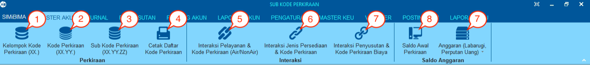
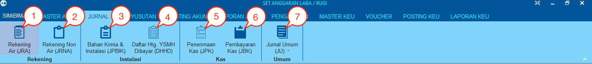
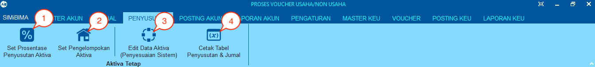
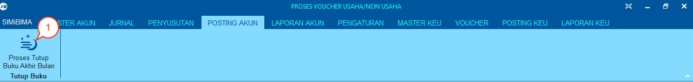
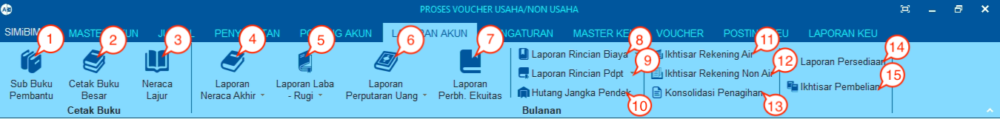
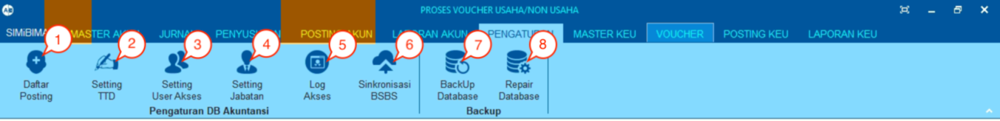

= Menu Modul Akuntansi

Terdapat 6 menu dalam Modul Akuntansi, yaitu:

1. Menu Master Akun
+
.Detail Menu Master Akun
[%collapsible]
====

1. Ikon *Kelompok Kode Perkiraan (XX.)* menyediakan fasilitas untuk set awal kode dan mengelola data yang hanya memiliki 2 digit kode.
2. Ikon *Kode Perkiraan (XX.YY)* menyediakan fasilitas untuk set awal kode dan mengelola data yang memiliki 4 digit kode.
3. Ikon *Sub. Kode Perkiraan (XX.YY.ZZ)* menyediakan fasilitas untuk set awal kode mengelola data yang memiliki 6 digit kode.
4. Ikon *Cetak Daftar Kode Perkiraan* menyediakan fasilitas untuk mencetak daftar kode perkiraan dalam bentuk dokumen.
5. Ikon Interaksi *Pelayanan & Kode Perkiraan (Air/NonAir)* menyediakan fasilitas untuk mengelola dan mengatur pos kode perkiraan penerimaan air dan non-air.
6. Ikon *Interaksi Jenis Persediaan & Kode Perkiraan* menyediakan fasilitas untuk integrasi dan mengatur pos kode perkiraan persediaan & aktiva untuk keperluan Jurnal Pemakaian Bahan Instalasi & Kimia (JPBIK).
7. Ikon *Interaksi Penyusutan & Kode Perkiraan Biaya* menyediakan fasilitas untuk integrasi dan mengatur pos kode akumulasi & biaya penyusutan untuk keperluan jurnal penyusutan aktiva.
8. Ikon *Saldo Awal Perkiraan* menyediakan fasilitas untuk mengatur saldo awal yang hanya bisa dilakukan di awal tahun dan menghitung saldo.
9. Ikon *Anggaran (Laba rugi, Perputaran Uang)* menyediakan fasilitas untuk mengelola anggaran laba rugi dan perputaran uang.
====
2. Menu Jurnal
+
.Detail Menu Jurnal
[%collapsible]
====

1. Ikon *Rekening Air (JRA)* menyediakan fasilitas untuk melihat dan mencetak Jurnal Rekening Air.
2. Ikon *Rekening Non Air (JRNA)* menyediakan fasilitas untuk melihat dan mencetak Jurnal Rekening Non-Air.
3. Ikon *Bahan Kimia & Instalasi (JPBIK)* menyediakan fasilitas untuk melihat dan mencetak Jurnal Pemakaian Bahan Instalasi & Kimia.
4. Ikon *Daftar Htg. YSMH Dibayar (DHHD)* menyediakan fasilitas untuk melihat dan mencetak Daftar Hutang Yang Sudah dan Masih Harus Dibayar atau Daftar Hutang yang Harus Ditagih.
5. Ikon *Penerimaan Kas (JPK)* menyediakan fasilitas untuk melihat dan mencetak Jurnal Penerimaan Kas.
6. Ikon *Pembayaran Kas (JBK)* menyediakan fasilitas untuk melihat dan mencetak Jurnal Bayar Kas.
7. Ikon *Jurnal Umum (JU)* menyediakan fasilitas untuk mengelola data dan mencetak Jurnal Umum.
====
3. Menu Penyusutan
+
.Detail Menu Penyusutan
[%collapsible]
====

1. Ikon *Set Prosentase Penyusutan Aktiva* menyediakan fasilitas untuk mengatur prosentase penyusutan.
2. Ikon *Set Pengelompokkan Aktiva* menyediakan fasilitas untuk mengatur pengelompokkan aktiva.
3. Ikon *Edit Data Aktiva (Penyesuaian Sistem)* menyediakan fasilitas untuk mengelola data aktiva.
4. Ikon *Cetak Tabel Penyusutan & Jurnal* menyediakan fasilitas untuk mencetak data dan jurnal penyusutan.
====
4. Menu Posting Akun
+
.Detail Menu Posting Akun
[%collapsible]
====

1. Ikon *Proses Tutup Buku Akhir Bulan* digunakan untuk melakukan posting laporan akuntansi sesuai dengan periode bulan tertentu. 
====
5. Menu Laporan Akun
+
.Detail Menu Laporan Akun
[%collapsible]
====

1. Ikon *Sub Buku Pembantu* memiliki fungsi untuk mengecek _balance_ dan data pendukung antara laporan debit dan kredit yang tercatat di dalam buku besar
2. Ikon *Cetak Buku Besar* memiliki fungsi untuk melihat dan mencetak data laporan pembukuan yang dalam buku besar (_ledger_) yang dicatat oleh sistem berdasarkan dari Posting Akun.
3. Ikon *Neraca Lajur* memiliki fungsi untuk melihat laporan dari pencatatan jurnal neraca keuangan pada bulan berjalan di dalam sistem.
4. Ikon *Laporan Neraca Akhir* memiliki fungsi untuk melihat laporan dari pencatatan jurnal neraca keuangan dengan akumulasi terakhir yang ada di dalam sistem.
5. Ikon *Laporan Laba Rugi* terdapat submenu *Laporan Laba Rugi Detail*, *Laporan Laba Rugi Rekap*, *Laporan Laba Rugi SAK-ETAP* memiliki fungsi untuk melihat laporan dari pencatatan jurnal keuntungan dan kerugian yang didapatkan oleh perusahaan dan dicatat oleh sistem. 
6. Ikon *Laporan Perputaran Uang* terdapat submenu *Metode Langsung* dan *Metode Tidak Langsung* memiliki fungsi untuk melihat laporan arus kas (_cash flow_) yang dicatat oleh sistem.
7. Ikon *Laporan Perubahan Ekuitas* memiliki fungsi untuk melihat laporan yang menggambarkan peningkatan atau penurunan aktiva bersih atau kekayaan selama periode tertentu.
8. Ikon *Laporan Rincian Biaya* terdapat submenu *Laporan Rincian Biaya Langsung*, *Laporan Rincian Biaya SAK-ETAP*, *Laporan Rincian Biaya Kombinasi* memiliki fungsi untuk melihat rincian laporan biaya operasional dari bisnis yang dilakukan oleh perusahaan.
9. Ikon *Laporan Rincian Pendapatan* terdapat submenu *Laporan Rincian Pendapatan Langsung* dan  *Laporan Rincian Pendapatan SAK-ETAP* yang memiliki fungsi untuk melihat rincian pendapatan dari transaksi bisnis PDAM yang dilakukan oleh perusahaan.
10. Ikon *Hutang Jangka Pendek* memiliki fungsi untuk melihat laporan hutang jangka pendek.
11. Ikon Ikhtisar Rekening Air memiliki fungsi untuk melihat laporan dari pencatatan ikhtisar rekening air pada sistem.
12. Ikon *Ikhtisar Rekening Non Air* memiliki fungsi untuk melihat laporan dari pencatatan ikhtisar rekening non air pada sistem.
13. Ikon *Konsolidasi Penagihan* memiliki fungsi untuk melihat kumpulan laporan dari pencatatan setiap jenis rekening PDAM.
14. Ikon *Laporan Persediaan* memiliki fungsi untuk melihat laporan dari pencatatan laporan tentang persediaan bahan kimia, ATK, bahan instalasi (pipa air, meter air, aksesoris, dan lainnya).
15. Ikon *Laporan Pembeliaan* memiliki fungsi untuk melihat laporan dari pembelian dari aplikasi Gudang.
====
6. Menu Pengaturan
+
.Detail Menu Pengaturan
[%collapsible]
====

1. Ikon *Daftar Posting* menyediakan fasilitas untuk mengatur daftar posting yang telah diunggah pada menu Posting Akun.
2. Ikon *Setting TTD* menyediakan fasilitas untuk mengatur daftar persona atau PIC yang akan menjadi tujuan tembusan untuk melakukan pengesahan dokumentasi dari laporan akuntansi.
3. Ikon *Setting User Akses* menyediakan fasilitas untuk mengatur dan mengelola akses dari user personal di dalam sistem.
4. Ikon *Setting Jabatan* menyediakan fasilitas untuk melakukan pengelolaan jabatan/role user di dalam sistem.
5. Ikon *Log Akses* menyediakan fasilitas untuk menampilkan data log aktivitas dari user yang mengakses sistem.
6. Ikon *Sinkronisasi BSBS* menyediakan fasilitas untuk melakukan sinkronisasi data yang terdapat di billing pada aplikasi (akuntansi, golongan, dan lain-lain).
7. Ikon *Backup Database* menyediakan fasilitas untuk melakukan backup database yang ada di dalam sistem.
8. Ikon *Repair Database* menyediakan fasilitas untuk melakukan update database jika terjadi sebuah eror atau tidak bisa diakses.
====
