= Mencetak Jurnal

== Mencetak Jurnal Rekening 

Fitur ini digunakan untuk mencetak jurnal rekening air maupun rekening non air. Berikut adalah langkah-langkah dalam mencetak jurnal tersebut :

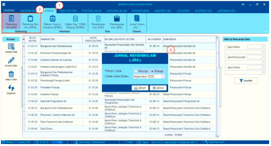

1. Pilih menu *Jurnal*

2. Pilih ikon *Rekening Air (JRA)* atau *Rekening non-Air(JRNA)*

3. Selanjutnya akan muncul _pop-up form_ yang sesuai dengan ikon yang telah dipilih sebelumnya. Isi pada Pilihan *Cetak* dan *Bulan* untuk ditampilkan agar dapat dicetak. Berikut adalah contoh dari _pop-up form_ tersebut:

- Jurnal Rekening Air (JRA)
+
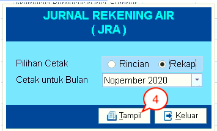

- Jurnal Rekening Non-Air (JRNA) 
+
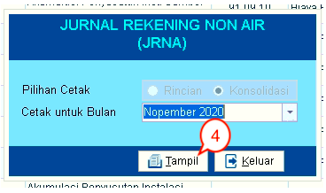

4. Klik pada tombol *Tampil* untuk menampilkan pratinjau (_preview_) jurnal rekening yang akan dicetak. Silakan klik ikon *Print* pada pratinjau dokumen untuk mencetaknya.

== Mencetak Jurnal Instalasi

Fitur ini digunakan untuk mencetak jurnal bahan kimia & instalasi (JPBIK) dan Daftar Htg. YSMH Dibayar (DHHD). Untuk mencetaknya, ikuti langkah-langkah berikut :

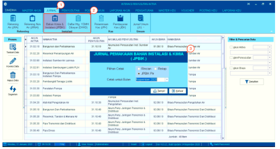

1. Pilih menu *Jurnal*

2. Pilih ikon *Bahan Kimia & Instalasi (JPBIK)* atau *Daftar Htg. YSMH Dibayar (DHHD)*

3. Selanjutnya akan muncul _pop up form_ yang sesuai dengan ikon yang telah dipilih sebelumnya. Isi pada *Pilihan Cetak* dan *Bulan/Tanggal* untuk ditampilkan agar dapat dicetak. berikut adalah contoh dari _pop-up form_ tersebut.  Berikut adalah contoh dari _pop-up form_ tersebut:

- Jurnal Pemakaian Bahan Kimia & Instalasi (JPBIK)
+
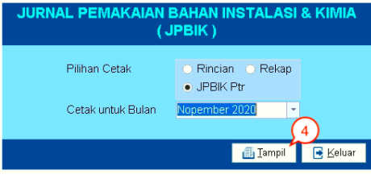

- Jurnal Daftar Hutang Sudah & Harus Dibayar 
+
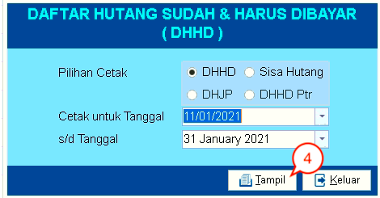

4. Klik tombol *Tampil* untuk menampilkan pratinjau (preview) jurnal instalasi yang akan dicetak. Silakan klik ikon *Print*  pada pratinjau dokumen untuk mencetaknya.

== Mencetak Jurnal Kas

Fitur ini digunakan untuk mencetak jurnal penerimaan kas (JPK) dan jurnal pembayaran Kas (JBK). Berikut adalah langkah-langkah untuk mencetaknya :

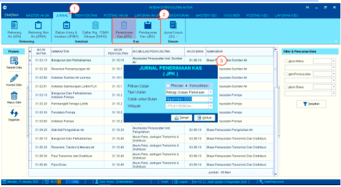

1. Pilih menu *Jurnal*

2. Pilih ikon *Penerimaan Kas (JPK)* atau *Pembayaran Kas (JBK)*

3. Selanjutnya akan muncul _pop-up form_ yang sesuai dengan ikon yang telah dipilih sebelumnya. Isi pada Pilihan Cetak, Bulan/Tanggal, Wilayah  untuk ditampilkan agar dapat dicetak. berikut adalah contoh dari _pop-up form_ tersebut.  Berikut adalah contoh dari _pop-up form_ tersebut:

- Jurnal Penerimaan Kas (JPK)
+
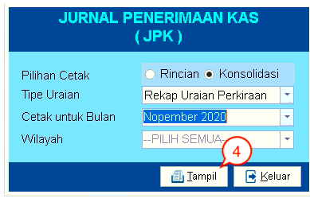

- Jurnal Pembayaran Kas (JBK) 
+
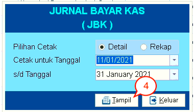

4. Klik pada tombol *Tampil* untuk menampilkan pratinjau (preview) jurnal instalasi yang akan dicetak. Silakan klik ikon *Print* pada pratinjau dokumen untuk mencetaknya.

== Mengelola Data Jurnal Umum

Fitur ini digunakan untuk memproses data jurnal umum seperti *tambah data jurnal*, *koreksi data jurnal*, h*apus data jurnal*, dan *memperbarui data jurnal*. Berikut adalah langkah-langkahnya:

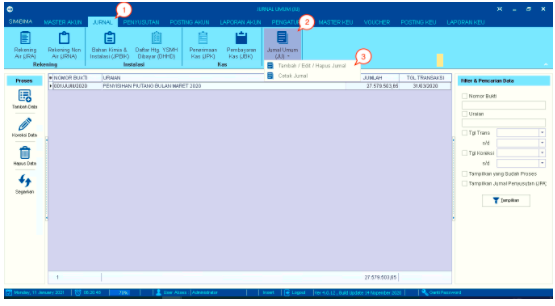

1. Pilih menu *Jurnal*

2. Pilih ikon *Jurnal Umum (JU)*

3. Pilih sub-menu *Tambah/Edit/Hapus Jurnal*
+
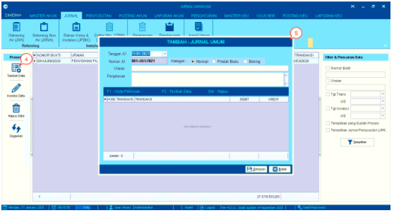

4. Klik ikon *Tambah Data* untuk memunculkan _form_  koreksi  jurnal umum.

5. Isi data secara lengkap, kemudian klik pada tombol *Simpan*.
+
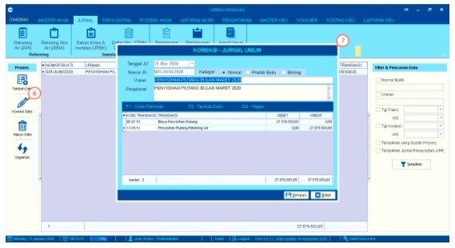

6. Pilih data yang akan dikoreksi pada tabel yang tersedia, kemudian klik ikon *Tambah Data* untuk memunculkan _form_  koreksi  jurnal umum

7. Setelah melakukan perubahan, Klik pada tombol *Simpan*
+
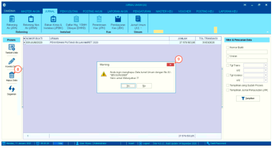

8. Pilih data yang akan dihapus, kemudian klik ikon *Hapus Data* hingga muncul _pop up_ pemberitahuan apakah Anda yakin akan menghapus data tersebut seperti pada gambar di atas

9. Klik pada tombol *Yes* untuk menghapus data. Klik pada tombol *No* untuk membatalkan penghapusannya.
+
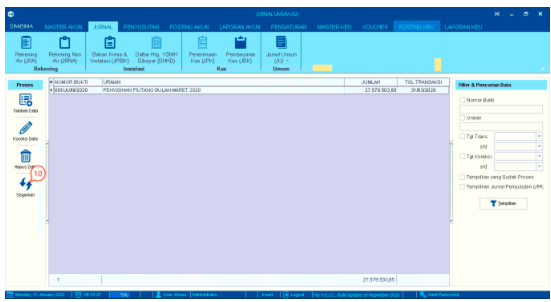

10.  Klik pada ikon *Segarkan* untuk memperbarui data.

== Mencetak Jurnal Umum

Fitur ini digunakan untuk mencetak jurnal umum. Ikuti langkah-langkah berikut untuk mencetak jurnal tersebut:

image::../images-akuntansi/akuntansi-mencetak-jurnal-umum-1.png[align="center"]

1. Pilih menu *Jurnal*

2. Pilih ikon *Jurnal Umum*

3. Pilih menu *Turunan Cetak Jurnal*
+
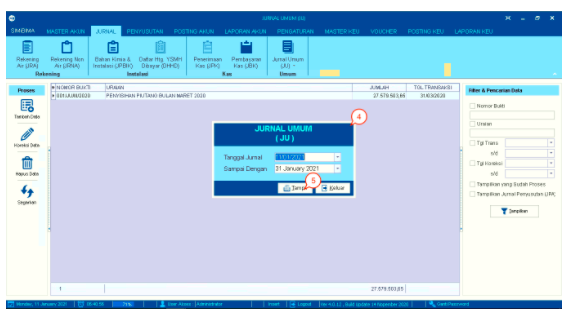

4. Selanjutnya akan muncul _pop-up form_ yang meminta Anda untuk melengkapi periode tanggal jurnal umum yang akan dicetak

5. Klik pada tombol *Tampil* untuk menampilkan pratinjau (_preview_) jurnal umum yang akan dicetak. Silakan klik ikon *Print* untuk pada pratinjau dokumen untuk mencetaknya.