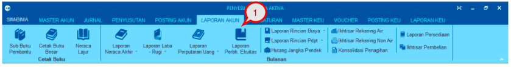
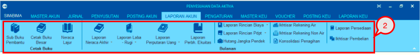
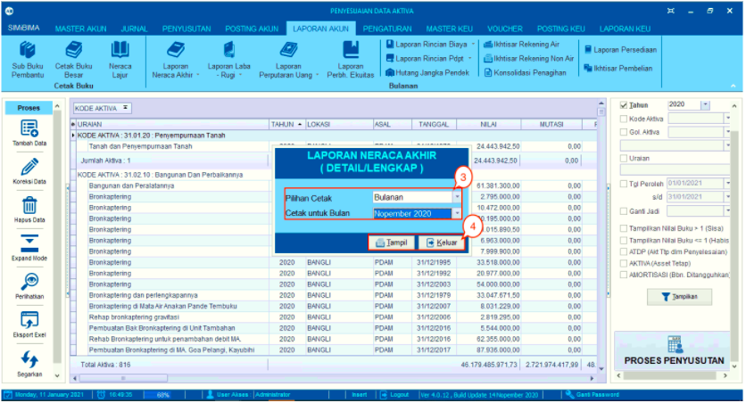
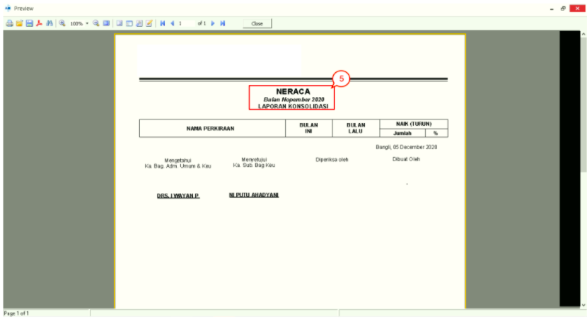

= Menampilkan Laporan Akun

Berikut langkah-langkah untuk menampilkan laporan pada Modul Akuntansi : 

1. Pilih Menu *Laporan Akun*, untuk memilih kategori laporan yang diinginkan

+

2. Pilih kategori laporan yang diinginkan

+

3. Setelah memilih kategori laporan, selanjutnya akan muncul _filter_ untuk menampilkan data laporan yang dipilih.

4. Setelah mengisi _filter_ pada pop-up yang muncul, selanjutnya klik tombol *Tampil* untuk menampilkan Laporan

+

5. Data laporan sesuai kategori dan _filter_ akan ditampilkan sesuai gambar diatas