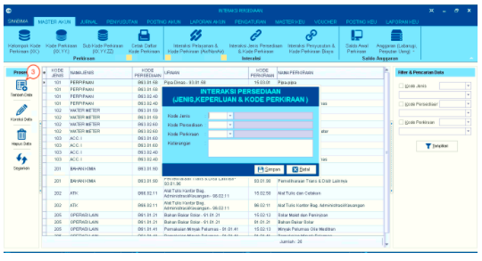

= Mengelola Data Interaksi

Fitur ini digunakan untuk memproses data interaksi seperti melakukan menambah data, mengoreksi data, menghapus data, dan memperbarui data. Berikut adalah langkah-langkahnya :

1. Pilih menu *Master Akun*

2. Pilih *salah satu ikon* dari Interaksi Pelayanan & Kode Perkiraan (Air/Non Air), Interaksi Jenis Persediaan & Kode Perkiraan, Interaksi Penyusutan & Kode Perkiraan Biaya

+

3. Untuk *menambahkan data baru*, klik ikon *Tambah Data* hingga muncul salah satu _form_ sesuai dengan ikon interaksi yang telah dipilih sebelumnya. Kemudian *masukkan data-data* sesuai yang diminta pada _form_.

- _Form_ Interaksi Pelayanan & Kode Perkiraan (Air/NonAir)
+

- _Form_ Interaksi Jenis Persediaan & Kode Perkiraan
+
image::../images-akuntansi/akuntansi-mengelola-data-interaksi-4.png[align="center"]

- _Form_ Interaksi Penyusutan & Kode Perkiraan Biaya
+

4. Klik pada tombol *Simpan* untuk menambahkan data

+

5. Untuk melakukan *perubahan data*, pilihlah data yang ingin diubah pada tabel yang tersedia kemudian klik ikon *Koreksi Data*.

6. Selanjutnya akan muncul _form_ *perubahan data* seperti pada gambar dibawah ini. Ubah data yang diperlukan lalu klik tombol *Simpan*.

+

7. Untuk *menghapus data*, pilihlah data yang ingin dihapus pada tabel yang tersedia seperti kemudian klik ikon *Hapus Data*  

8. Selanjutnya _pop up_ pemberitahuan, jika Anda yakin untuk menghapus data klik tombol *Yes*, jika tidak klik tombol *No*.

+

9. Klik ikon *Segarkan* untuk memperbarui data, jika data-data yang ditampilkan tidak berubah setelah melakukan proses *tambah data*, *koreksi data*, maupun *hapus data*.