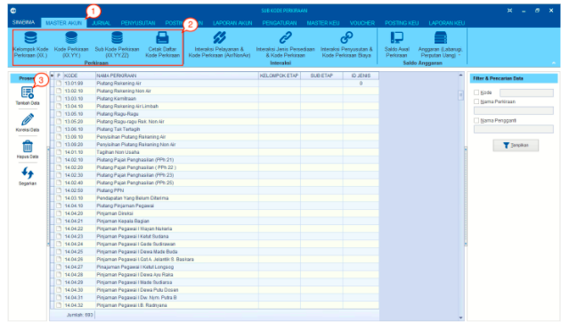
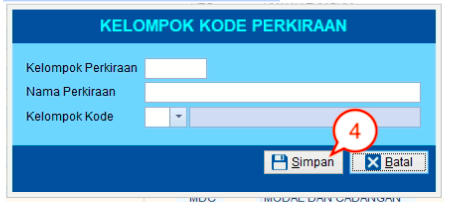
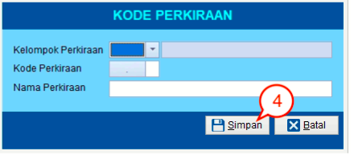
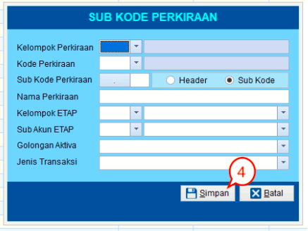
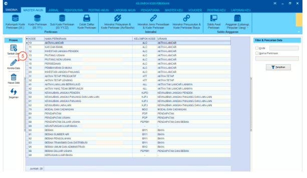
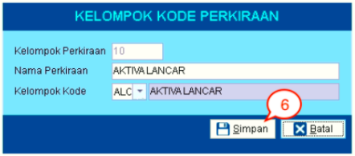
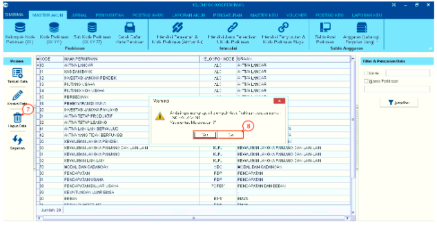
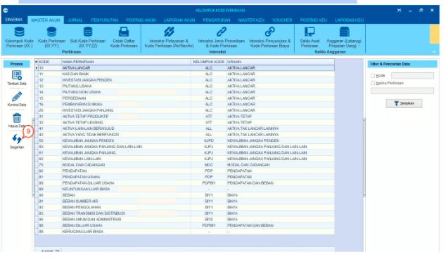
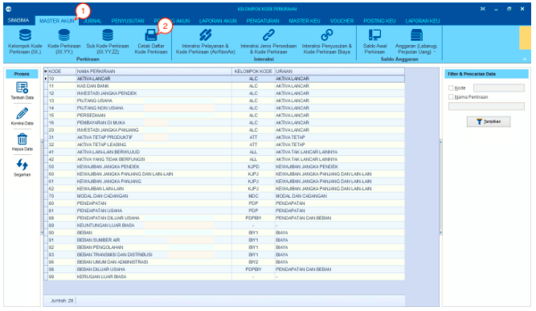
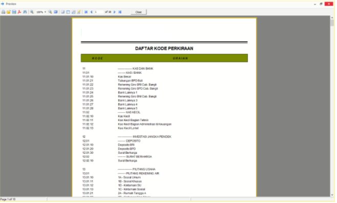

= Mengelola Data Perkiraan

Berikut adalah beberapa fitur dari menu *Perkiraan* :

== Menambah, Mengubah, dan Menghapus Data Perkiraan

Fitur ini digunakan untuk memproses data seperti melakukan tambah data, koreksi data, hapus data, dan memperbarui data. Berikut langkah-langkahnya :

1. Pilih menu *Master Akun*

2. Pilih *salah satu ikon* dari Kode Perkiraan (Kelompok Kode Perkiraan (XX) atau Kode Perkiraan (XX. YY.) atau Sub Kode Perkiraan (XX.YY.ZZ)) sesuai yang dibutuhkan

3. Untuk *menambahkan data baru*, klik ikon *Tambah Data*, hingga muncul salah satu _form_ sesuai dengan ikon perkiraan yang telah dipilih sebelumnya. Kemudian *masukkan data-data* sesuai yang diminta pada _form_.

- _Form_ Kelompok Kode Perkiraan (XX)
+

- _Form_ Kode Perkiraan (XX. YY.)
+

- _Form_ Sub Kode Perkiraan (XX. YY. ZZ)
+

4. Klik tombol *Simpan* untuk menambahkan data

+

5. Untuk melakukan perubahan data, pilihlah data yang ingin diubah pada tabel yang tersedia kemudian klik ikon *Koreksi Data*

+

6. Selanjutnya, akan muncul _form_ perubahan data seperti pada gambar dibawah ini. Ubah data yang diperlukan lalu klik tombol *Simpan*

+

7. Untuk *menghapus data*, pilihlah data yang ingin dihapus pada tabel yang tersedia kemudian klik ikon *Hapus Data* 

8. Klik tombol *Yes* pada _pop-up_ pemberitahuan yang muncul untuk menghapus data. Klik tombol *No* jika ingin membatalkan penghapusan data

+

9. Klik pada tombol *Segarkan* untuk memperbarui data jika data-data yang ditampilkan tidak berubah setelah melakukan proses tambah data, koreksi data, maupun hapus data .

== Mencetak Daftar Kode Perkiraan

Fitur ini digunakan untuk mencetak dokumen yang di dalamnya terdapat daftar kode perkiraan yang telah dimasukkan pada proses sebelumnya. Ikuti langkah-langkah berikut untuk mencetak daftar kode perkiraan:

1. Pilih menu *Master Akun*

2. Pilih ikon *Cetak Daftar Kode Perkiraan*

+

3. Selanjutnya akan muncul tinjauan (_preview_) dari dokumen Daftar Kode Perkiraan yang akan dicetak. Silakan klik ikon *Print* untuk mencetak dokumen.