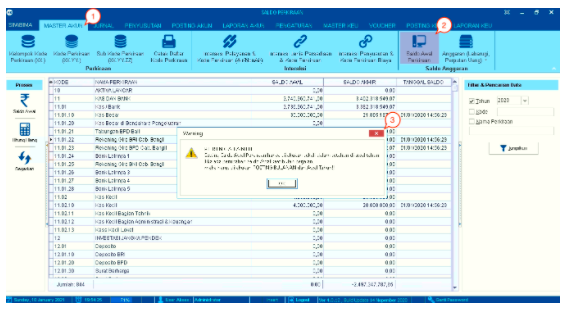
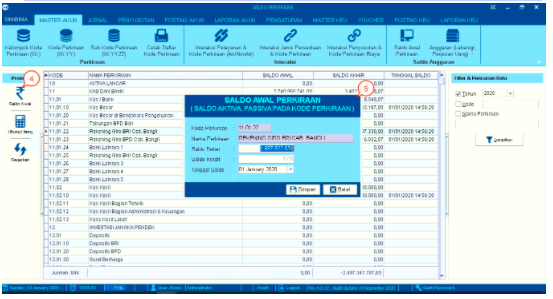
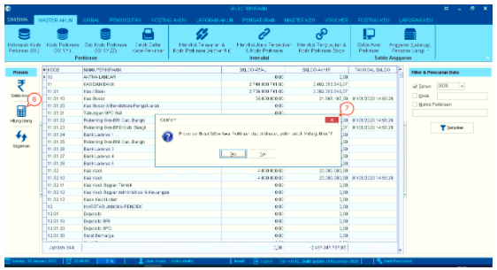
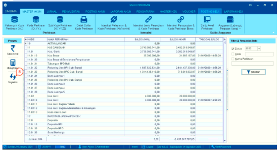
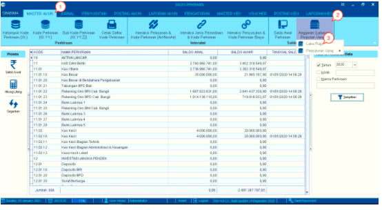
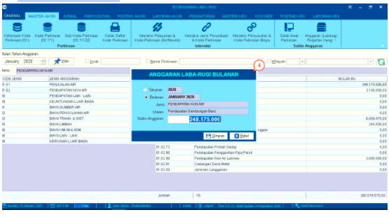
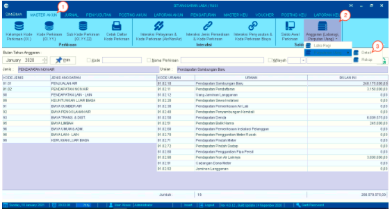
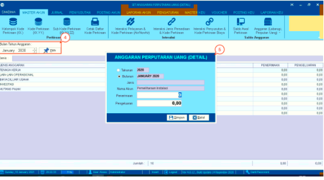
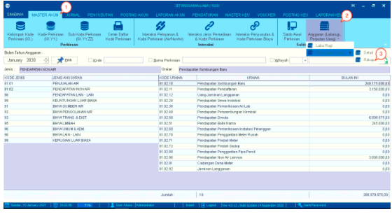
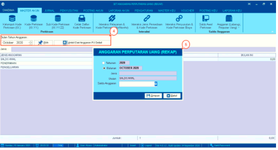

= Mengelola Saldo Anggaran

== Menambah, Menghitung Ulang dan Memperbarui Saldo

Fitur ini digunakan untuk memproses data saldo seperti *set saldo awal*, *hitung ulang saldo*, dan *memperbarui saldo*. Berikut adalah langkah-langkah untuk memproses saldo :

1. Pilih menu *Master Akun*

2. Pilih ikon *Saldo Awal Perkiraan*

3. Selanjutnya akan muncul _pop-up_ peringatan bahwa  pengaturan saldo awal perkiraan hanya dapat dilakukan sekali dalam setahun. Klik pada tombol *OK*

+

4. Klik pada *Saldo Awal* setelah  memilih data yang memiliki *6 digit kode* (Sub Kode Perkiraan).

5. Isi _field_ *Saldo Debet* untuk memasukkan nilai saldo awal, kemudian klik pada tombol *Simpan*. 

+

6. Klik tombol *Hitung Ulang* untuk melakukan penghitungan ulang.

7. Selanjutnya akan muncul _pop-up_ pemberitahuan. Jika yakin untuk melakukan perhitungan ulang, klik pada tombol *Yes*. Jika tidak, klik pada tombol *No*.

+

8. Klik ikon *Segarkan* untuk memperbarui data, jika data-data yang ditampilkan tidak berubah setelah melakukan proses set saldo awal ataupun hitung ulang.

== Menambahkan Anggaran Laba Rugi

Fitur ini digunakan untuk memasukkan anggaran yang berkaitan dengan laba rugi. Ikuti langkah-langkah berikut untuk melakukan input:

1. Pilih menu *Master Akun*

2. Pilih ikon *Anggaran (Laba rugi Perputaran Uang)*

3. Pilih menu *Laba Rugi*

+

4. Klik 2 kali pada data yang dipilih hingga muncul form seperti pada gambar di atas. Masukkan *Saldo Anggaran* pada kolom yang tersedia, kemudian klik tombol *Simpan*.

== Menambahkan Anggaran dengan Detail Perputaran Uang

Fitur ini digunakan untuk memasukkan anggaran yang berkaitan dengan perputaran uang. Ikuti langkah-langkah berikut untuk melakukan input:

1. Pilih menu *Master Akun*

2. Pilih ikon *Anggaran (Laba rugi Perputaran Uang)*

3. Pilih menu *Perputaran Uang Detail*

+

4. Pilih *Bulan* pada kolom bulan tahun anggaran, dan klik tombol *Pilih*.

5. Klik 2 kali pada data yang telah dipilih hingga muncul form seperti pada gambar di atas. Masukkan *Saldo Anggaran* pada kolom yang tersedia, kemudian klik pada tombol *Simpan*.

== Menambahkan Anggaran dengan Rekap Perputaran Uang

Fitur ini digunakan untuk memasukkan anggaran yang berkaitan dengan perputaran uang. Ikuti langkah-langkah berikut untuk melakukan input:

1. Pilih menu *Master Akun*

2. Pilih ikon *Anggaran (Laba rugi Perputaran Uang)*

3. Pilih menu *Perputaran Uang Rekap*

+

4. Pilih *bulan* pada kolom bulan tahun anggaran, kemudian klik tombol *Pilih*.

5. Klik 2 kali pada data yang telah dipilih hingga muncul form seperti pada gambar dibawah ini, lalu masukkan *Saldo Anggaran* pada kolom yang tersedia dan klik tombol *Simpan*.