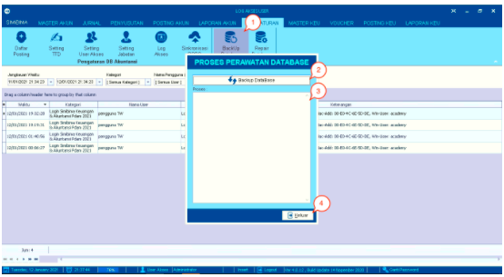
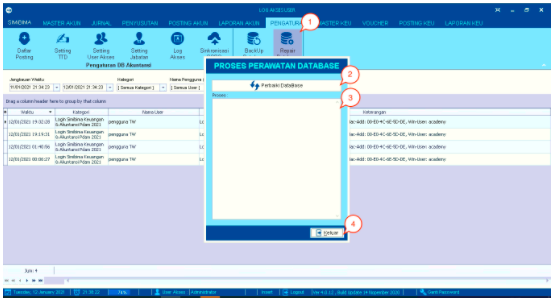

= Backup dan Repair Database

Fitur ini merupakan sebuah fungsi yang digunakan untuk melakukan *Backup* dan *Repair* _database_ yang ada di dalam sistem. Berikut langkah-langkah yang dapat diikuti untuk melakukan perbaikan _database_:

== Backup Database

1. Pilih ikon *Backup Database* 

2. Klik *Backup Database*

3. Tunggu hingga proses selesai

4. Jika sudah selesai, silakan klik tombol *Keluar*.

== Repair Database

1. Pilih ikon *Repair Database*

2. Klik *Perbaiki Database*

3. Tunggu hingga proses selesai

4. Jika sudah selesai, silakan klik tombol *Keluar*.