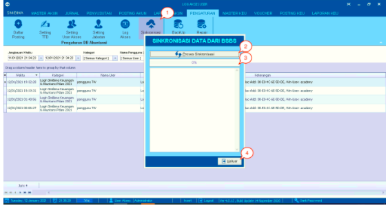

= Melakukan Sinkronisasi Data Pada Aplikasi Billing

Fitur ini merupakan sebuah fungsi yang digunakan untuk melakukan sinkronisasi data yang terdapat di _billing_ pada aplikasi (Loket, Golongan, dan lain-lain). Berikut adalah langkah-langkah yang dapat diikuti untuk melakukan sinkronisasi:

1. Pilih ikon *Sinkronisasi BSBS* hingga muncul _pop-up_ berisikan fitur untuk melakukan sinkronisasi.

2. Klik *Proses Sinkronisasi*

3. Tunggu hingga proses selesai

4. Jika sudah selesai, silakan klik tombol *Keluar*.