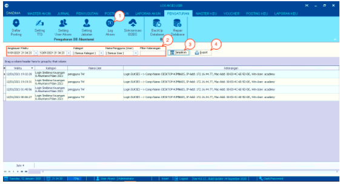
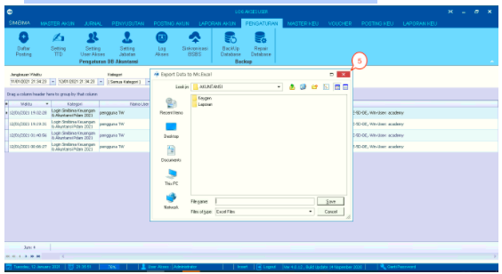

= Menampilkan Data Log Akses User

Fitur ini merupakan sebuah fungsi yang digunakan untuk menampilkan data _log_ aktivitas dari _user_ yang mengakses sistem. Adapun cara menampilkan data tersebut, _user_ dapat mengikut langkah-langkah berikut ini:

1. Pilih ikon *Log Akses* dari menu Pengaturan seperti yang ditunjukkan

2. Akan muncul laman dari _log_ akses aktivitas _user_ pilih interval waktu akses _log_ pada bagian *Jangkauan Waktu*,  *Kategori Akses* dari user, *Nama Pengguna* (_user_), kemudian masukkan *Filter Keterangan* (jika diperlukan) 

3. Klik tombol *Tampilkan* untuk mengeksekusi proses

4. Jika user ingin mengunduh data, silakan klik tombol *Export*

+

5. Pilih direktori penyimpanan dan berikan nama _file_. Apabila sudah selesai, klik pada tombol *Save*.
