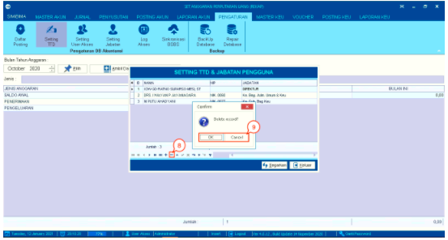

= Mengatur Daftar Persona dan TTD Jabatan Pengguna

Fitur ini merupakan sebuah fungsi yang digunakan untuk mengatur daftar persona atau PIC yang akan menjadi tujuan tembusan untuk melakukan pengesahan dokumentasi dari laporan akuntansi. Untuk mengakses fitur ini, user dapat mengikuti langkah berikut:

1. Klik ikon *Setting TTD* pada menu *Pengaturan* 

2. Akan muncul _pop-up_ berisikan kotak tentang daftar nama yang menjadi tembusan untuk melakukan pengesahan dokumen laporan akuntansi.

+

3. Klik pada *tanda tambah (+)* yang berada pada bagian bawah tabel untuk menambah data.

4. Baris pada tabel secara otomatis akan bertambah seperti pada poin 1 gambar di bawah ini. Isikan nama dan jabatan baru pada tembusan untuk melakukan pengesahan dokumen laporan akuntansi. 

5. Pilih tanda *centang (✓)* jika Anda yakin untuk menambah data atau pilih tanda *silang (X)* jika Anda ingin membatalkan.

+

6. Klik pada data untuk melakukan perubahan data. Isi data sesuai kebutuhan.

7. Setelah selesai, klik pada tombol *Segarkan*

+

8. Pilih data dan Klik *tanda minus (-)* untuk menghapus data tersebut.

9. Selanjutnya akan muncul _pop-up_ konfirmasi untuk menghapus data yang dipilih. Klik pada tombol *OK* untuk menghapus data. Klik pada tombol *Cancel* untuk membatalkan proses.