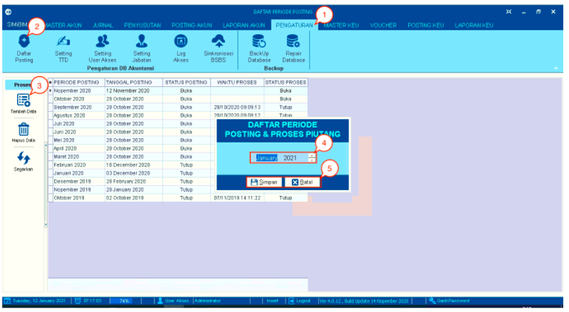
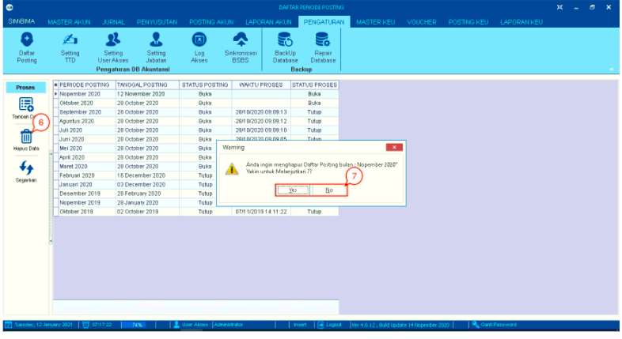
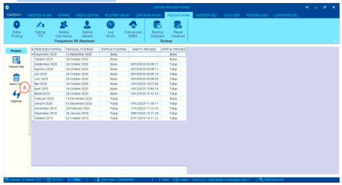

= Mengelola Daftar Posting Akun

Fitur ini merupakan sebuah fungsi yang digunakan untuk mengatur daftar posting yang telah diunggah pada menu Posting Akun. Berikut contoh tampilan dari fitur tersebut:

1. Klik pada menu *Pengaturan*

2. Klik pada *Daftar Posting*

3. Klik ikon *Tambah Data* untuk menambahkan data pada bagian kiri halaman 

4. Selanjutnya akan muncul _pop-up_ kotak berisikan data daftar periode posting dan proses piutang. Silakan pilih data sesuai dengan kebutuhan. 

5. Klik pada tombol *Simpan*. Klik pada tombol *Keluar* untuk membatalkan proses.

+

6. Pilih pada data yang ingin dihapus, kemudian klik ikon *Hapus Data* pada bagian kiri halaman

7. Selanjutnya akan muncul _pop-up_ kotak dialog berisikan konfirmasi penghapusan data. Klik tombol *Yes* untuk menghapus data. Klik tombol *No* untuk membatalkannya.

+

8. Klik pada ikon *Segarkan* di bagian kiri halaman untuk memperbaharui data.