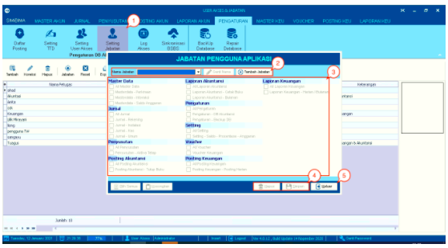

= Mengelola Jabatan atau Role User

Fitur ini merupakan sebuah fungsi yang digunakan untuk melakukan pengelolaan jabatan/_role user_ di dalam sistem. Untuk menentukan _role_ yang dapat diakses/dilakukan oleh _user_, silakan ikuti  langkah-langkah berikut:

1. Pilih ikon *Setting Jabatan* pada menu *Pengaturan*

2. Akan muncul _pop-up_ berisikan fitur yang dapat diakses oleh _user_. Pilih nama _role_ / jabatan yang ingin diatur aksesnya. Jika _role_ yang ingin dikelola belum terdaftar di dalam sistem, klik tombol *Tambah Jabatan* 

3. Setelah selesai, berikan centang pada akses yang ingin diberikan pada jabatan/role dari _user_. Jika ingin mencentang semuanya, klik tombol *Pilih Semua* pada bagian bawah kotak. Jika ingin menghapus centang dari semuanya, klik tombol *Kosongkan*

4. Jika sudah selesai, silakan klik tombol *Simpan*. Jika ingin menghapus data, klik tombol *Hapus*

5. Klik tombol *Keluar*, ketika proses sudah selesai.
