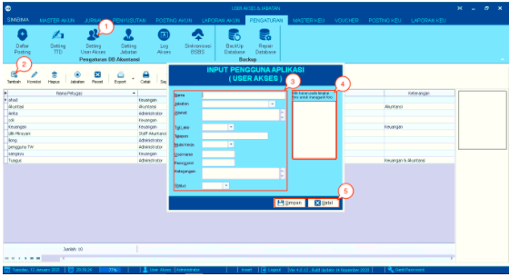
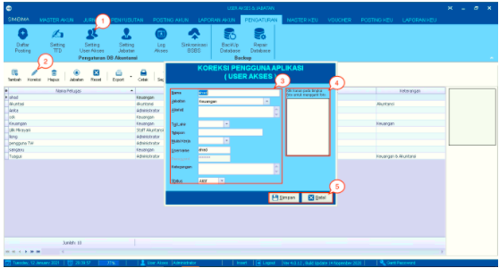
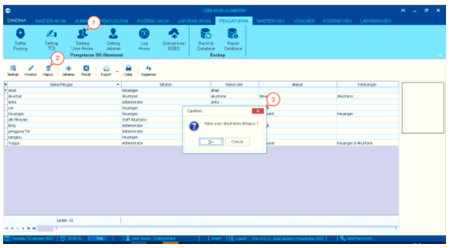
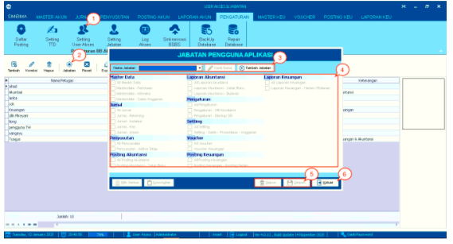
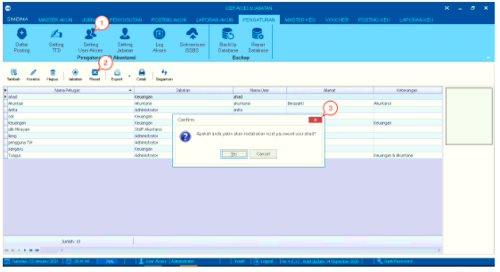
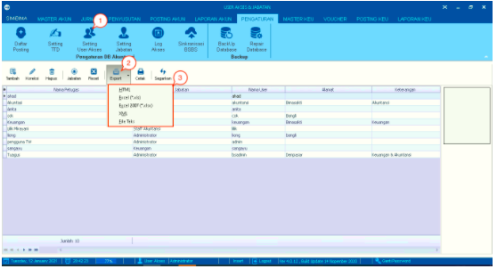
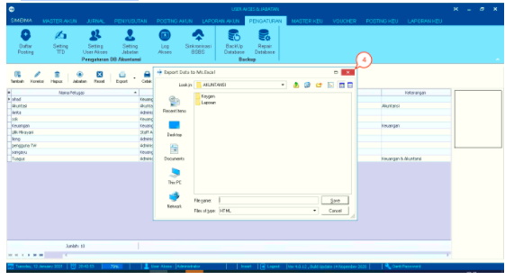
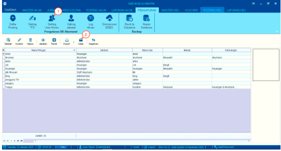
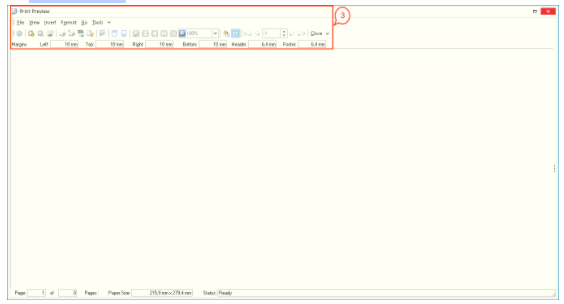
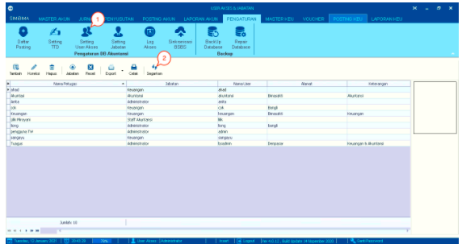

= Mengelola User Akses

Fitur ini merupakan sebuah fungsi yang digunakan untuk mengatur dan mengelola akses dari _user_ personal di dalam sistem. Adapun, cara untuk mengakses menu adalah dengan mengklik ikon *Setting User Akses* sehingga akan ditampilkan tabel berisikan data user beserta dengan jabatan/ _role_-nya dan lainnya. 

Di dalam menu ini, terdapat 8 submenu yang memiliki fungsinya masing-masing, yaitu: 

.*Tambah Data User*
[%collapsible]
====
Fitur ini digunakan untuk menambahkan data _user_ baru ke dalam sistem. Silakan ikuti langkah-langkah berikut untuk menambah data:

1. Klik ikon *Setting User Akses*

2. Klik ikon *Tambah*

3. Tambahkan data _user_ baru dengan cara mengisi setiap kolom yang diberikan pada _pop-up box_ Input Pengguna Aplikasi. Seluruh kotak harus diisi

4. Klik Kanan pada bingkai foto di sebelah kanan _pop-up box_ Input Pengguna Aplikasi untuk mengunggah foto

5. Klik pada tombol *Simpan* untuk menambahkan user. Klik pada tombol *Cancel* untuk membatalkan proses.
====

.*Koreksi Data User*
[%collapsible]
====
Fitur ini digunakan untuk mengoreksi data _user_ dalam sistem. Silakan ikuti langkah-langkah berikut untuk mengoreksi data:

1. Klik ikon *Setting User Akses*

2. Klik ikon *Koreksi*

3. Anda dapat mengoreksi data _user_ dengan cara mengisi setiap kolom yang diberikan pada _pop-up box_ Input Pengguna Aplikasi. Seluruh kotak harus diisi

4. Klik Kanan pada bingkai foto di sebelah kanan _pop-up box Input_ Pengguna Aplikasi untuk mengganti foto

5. Klik pada tombol *Simpan* untuk menyimpan pembaruan data. Klik pada tombol *Keluar* untuk membatalkan prosesnya.
====

.*Hapus Data User*
[%collapsible]
====
Fitur ini digunakan untuk menghapus data _user_ baru ke dalam sistem. Silakan ikuti langkah-langkah berikut untuk menghapus data:

1. Klik ikon *Setting User Akses*

2. Klik ikon *Hapus* 

3. Akan muncul kotak dialog berisikan konfirmasi penghapusan data. Klik tombol *Yes* jika setuju untuk menghapus data. Klik tombol *No* untuk membatalkannya.
====

.*Jabatan*
[%collapsible]
====
Fitur ini memiliki fungsi yang sama dengan menu Setting Jabatan, yaitu untuk mengelola akses _role_ seorang _user_ di dalam sistem. Adapun langkah-langkah adalah sebagai berikut:

1. Klik ikon *Setting User Akses*

2. Klik ikon *Setting Jabatan*

3. Sistem akan menampilkan _pop-up_ berisikan fitur yang dapat diakses oleh _user_. Pilih nama _role_ / jabatan yang ingin diatur aksesnya. Jika _role_ yang ingin dikelola belum terdaftar di dalam sistem, klik tombol *Tambah Jabatan* 

4. Selanjutnya, beri centang pada akses yang ingin diberikan pada jabatan / _role_ dari user. Jika ingin mencentang semuanya, klik tombol *Pilih Semua* pada bagian bawah kotak. Jika ingin menghapus centang dari semuanya, klik tombol *Kosongkan*

5. Jika sudah selesai, kemudian klik tombol *Simpan*. Jika ingin menghapus data, klik tombol *Hapus*

6. Klik tombol *Keluar* ketika proses sudah selesai.
====

.*Reset Data User*
[%collapsible]
====
Fitur ini digunakan untuk mengatur ulang kata sandi dari akun _user_ di dalam sistem. Ikuti langkah-langkah berikut untuk _reset_ sandi:

1. Klik ikon *Setting User Akses*

2. Klik ikon *Reset* 

3. Akan muncul kotak dialog berisikan konfirmasi penghapusan data. Klik tombol *Yes* jika setuju untuk menghapus data. Klik tombol *No* untuk membatalkanya.
====

.*Export Data User*
[%collapsible]
====
Fitur ini digunakan untuk mengekspor data _user_ di dalam sistem. Ikuti langkah-langkah berikut untuk mengekspor data:

1. Klik ikon *Setting User Akses*

2. Klik ikon *Export* 

3. Terdapat beberapa pilihan format dokumen yang bisa diekspor. Pilih sesuai dengan kebutuhan.

+

4. Pilih direktori penyimpanan dan berikan nama _file_. Apabila sudah selesai, klik pada tombol *Save*.
====

.*Cetak Data User*
[%collapsible]
====
Fitur ini digunakan untuk mencetak data _user_ di dalam sistem. Ikuti langkah-langkah berikut untuk mencetak data:

1. Klik ikon *Setting User Akses*

2. Klik ikon *Print* 

+

3. Halaman akan dialihkan ke tampilan _Print_ _Preview_. Jika sudah data sesuai, klik pada tombol *Print* untuk mencetak dokumen.
====

.*Memperbarui Data User*
[%collapsible]
====
Fitur ini digunakan untuk memperbarui data _user_ di dalam sistem. Ikuti langkah-langkah berikut untuk memperbarui data:

1. Klik ikon *Setting User Akses*

2. Klik ikon *Segarkan*.
====