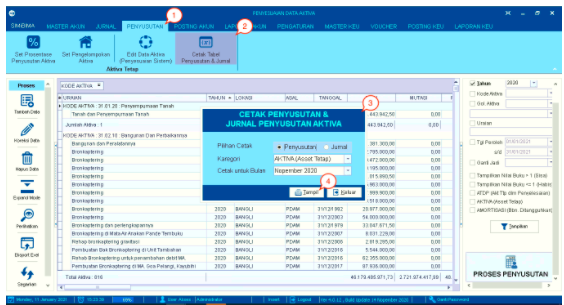
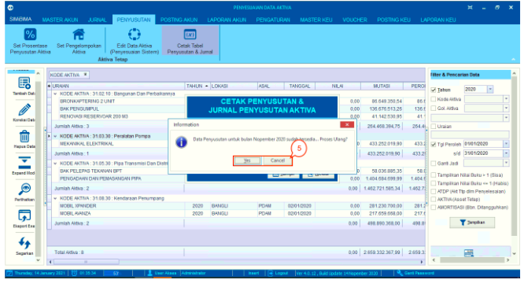
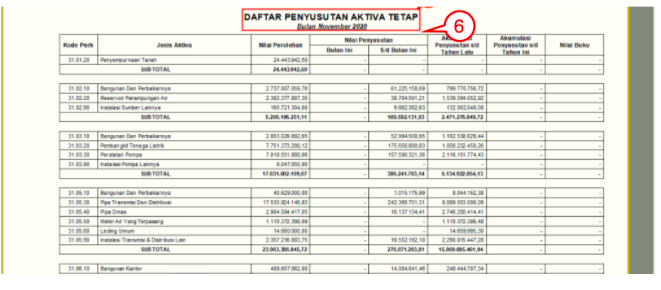

= Mencetak Jurnal Penyusutan

Fitur ini digunakan untuk mencetak jurnal penyusutan. Berikut  adalah detail langkah-langkahnya:

1. Pilih menu *Penyusutan*

2. Pilih ikon *Cetak Tabel Penyusutan & Jurnal*

3. Selanjutnya akan muncul _pop-up form_ untuk cetak penyusutan & jurnal penyusutan aktiva

4. Isi _form_ sesuai dengan jenis jurnal yang diinginkan seperti pilihan cetak, kategori, bulan yang ingin dicetak, kemudian klik tombol *Tampil*.

+

5. Apabila muncul _pop-up_ proses ulang, klik pada tombol *Yes* untuk melanjutkan proses. Klik pada tombol *No* untuk membatalkannya.

+

6. Sistem akan menampilkan pratinjau dokumen. Silakan klik ikon *Print* untuk pada pratinjau dokumen untuk mencetaknya.

