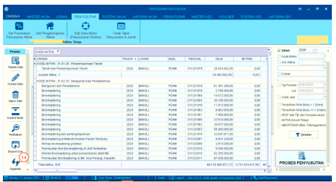

= Mengelola Data Aktiva

Fitur ini digunakan untuk mengelola data aktiva seperti *tambah data*, *koreksi data*, *hapus data*, *expand mode*, *eksport excel*, *segarkan*. Berikut langkah-langkahnya :

1. Pilih menu *Penyusutan*

2. Pilih ikon *Edit Data Aktiva (Penyusutan Sistem)*

3. Pilih _value_ pada filter, kemudian klik pada tombol *Tampilkan* untuk memunculkan tabel yang berisikan data aktiva.

+

+
Pilihan input terdiri dari 2, yaitu Otomatis dan manual input, yang artinya : 

- Otomatis input artinya didapatkan dari _voucher_ yang diinputkan yang masuk ke kode aktiva

- Manual input artinya didapatkan dari _voucher_ yang ditambah dari menu proses aktiva _voucher_

4. Klik ikon *Tambah Data* hingga muncul _form_ tambah data aktiva untuk menambahkan data.

5. Kemudian masukkan data-data sesuai yang diminta pada _form_. Setelah selesai klik tombol *Proses*

+

6. Pilihlah data yang ingin diubah pada tabel yang tersedia, lalu klik pada ikon *Koreksi Data (poin 4)* hingga muncul _form_ *koreksi data aktiva*. 

7. Ubah data yang diperlukan, kemudian klik tombol *Proses*.

+

8. Pilihlah data yang ingin dihapus pada tabel yang tersedia, kemudian klik pada ikon *Hapus Data* hingga muncul _pop-up_ konfirmasi. 

9. Klik pada tombol *Yes* untuk menghapus data. Klik pada tombol *No* untuk membatalkan penghapusannya.

+

10. Untuk melihat tampilan data pada tabel menjadi lebih _detail_, klik ikon *Expand Mode*. Data akan ditampilkan berdasarkan jenis kode aktiva.

+

11. Untuk melihat pratinjau (_preview_) daftar aset Perumda air minum, klik pada tombol *Perlihatkan*.

+

12. Untuk menyimpan data dalam _format_ Excel, klik ikon *Eksport Excel*.

13. Kemudian simpan _file_ pada direktori komputer dengan nama sesuai yang diinginkan. Klik tombol *Save* untuk menyimpan.

+

14. Klik tombol *Segarkan* untuk memperbarui data.

+

15. Klik tombol *Proses Penyusutan* hingga muncul _form_ Proses Penyusutan Aktiva.

16. Pilih bulan kemudian klik pada tombol *Proses Susut* untuk memulai proses penyusutan.