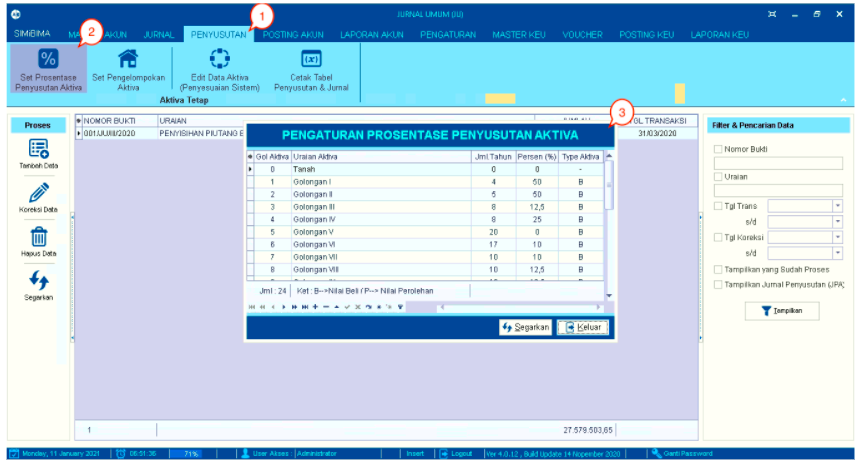
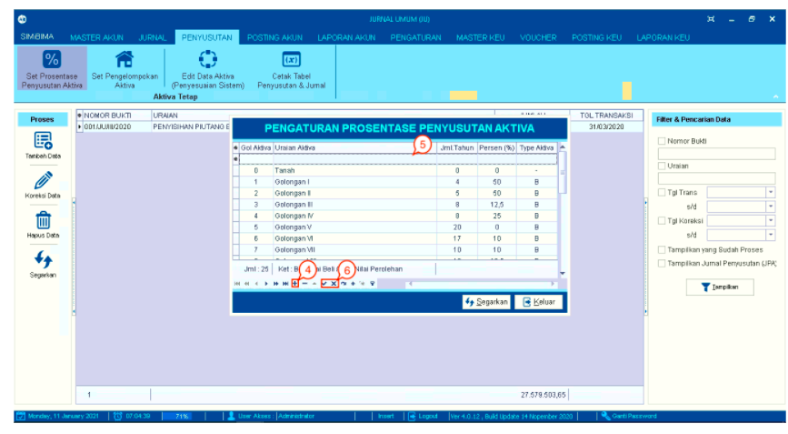
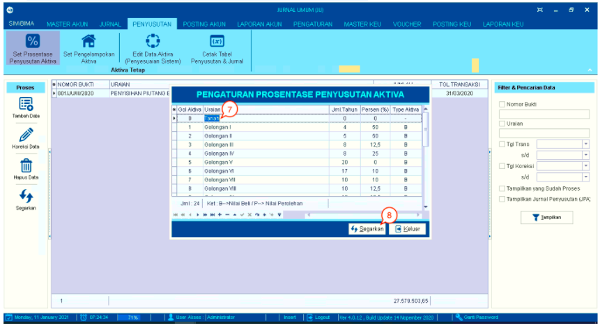
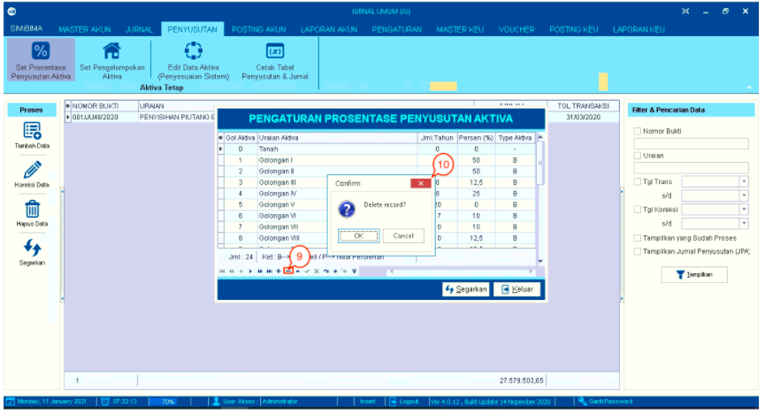

= Mengelola Data Persentase Penyusutan Aktiva

Fitur ini digunakan untuk melihat, membuat, menghapus, dan mengubah data prosentase penyusutan aktiva. Berikut adalah _detail_ langkah-langkahnya:

1. Pilih menu *Penyusutan*

2. Pilih ikon *Set Prosentase Penyusutan Aktiva*, 

3. Selanjutnya akan muncul _pop-up_ tabel pengaturan prosentase penyusutan aktiva yang terdiri dari kolom *golongan aktiva*, *uraian aktiva*, *jumlah tahun*, *persen*, dan *tipe aktiva*. 

+

4. Klik *tanda tambah (+)* yang berada pada bagian bawah tabel untuk menambah data.

5. Setelah menekan *tanda tambah (+)*, baris pada tabel secara otomatis akan bertambah seperti pada poin 1 gambar di bawah ini. Isikan nilai pada kolom aktiva, uraian aktiva, jumlah tahun, persen, dan tipe aktiva. 

6. Pilih *tanda centang (✓)* jika Anda yakin untuk menambah data atau pilih *tanda silang (X)* jika Anda ingin membatalkan.

+

7. Klik pada data untuk melakukan perubahan data. Isi data sesuai yang diinginkan.

8. Setelah selesai, klik pada tombol *Segarkan*.

+

9. Pilih data dan Klik *tanda minus (-)* untuk menghapus data tersebut

10. Selanjutnya akan muncul _pop-up_ konfirmasi untuk menghapus data yang dipilih. Kemudian Klik pada tombol *Yes* untuk menghapus data. Tombol *No* untuk membatalkan menghapus data.