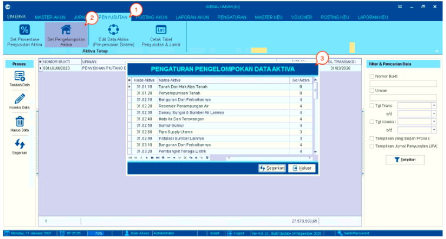
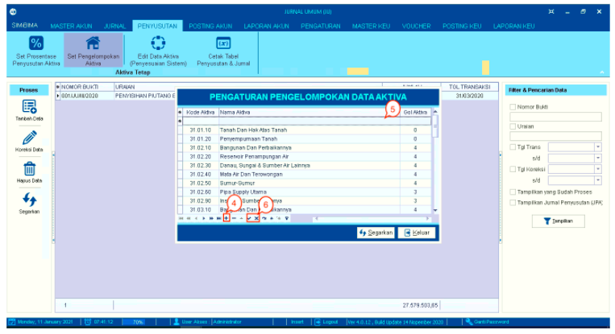
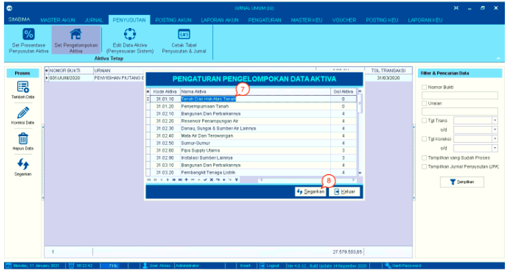
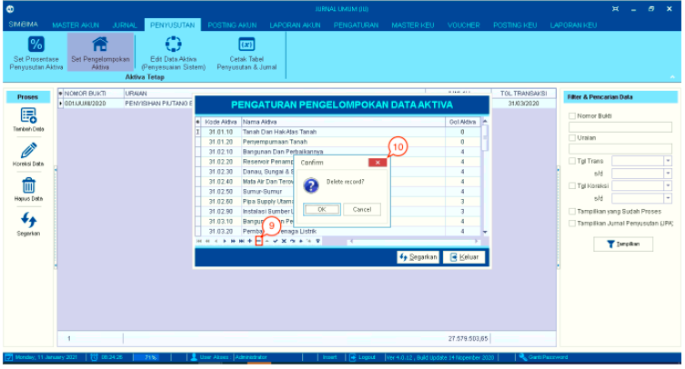

= Mengelola Pengelompokan Data Aktiva

Fitur ini digunakan untuk melihat, membuat, menghapus, dan mengubah pengelompokan data aktiva. Berikut langkah-langkahnya :

1. Pilih menu *Penyusutan*

2. Pilih ikon *Set Pengelompokan Aktiva*

3. Selanjutnya akan muncul _pop-up_ tabel pengaturan pengelompokan data aktiva yang terdiri dari kolom Kode Aktiva, Nama Aktiva, dan Gol. Aktiva

+

4. Klik *tanda tambah (+)* yang berada pada bagian bawah tabel untuk menambah data.

5. Setelah menekan *tanda tambah (+)*, baris pada tabel secara otomatis akan bertambah seperti pada poin 1 gambar di atas. Isikan nilai pada kolom aktiva, uraian aktiva, jumlah tahun, persen, dan tipe aktiva. 

6. Pilih *tanda centang (✓)* jika Anda yakin untuk menambah data atau pilih *tanda silang (X)* jika Anda ingin membatalkan.

+

7. Klik pada data untuk melakukan perubahan data. Isi data sesuai yang diinginkan.

8. Setelah selesai, klik pada tombol *Segarkan*.

+

9. Pilih data, kemudian klik *tanda minus (-)* untuk menghapus data tersebut.

10. Selanjutnya akan muncul _pop-up_ konfirmasi untuk menghapus data yang dipilih. Klik pada tombol *Yes* untuk menghapus data. Klik pada tombol *No* untuk membatalkan penghapusannya.