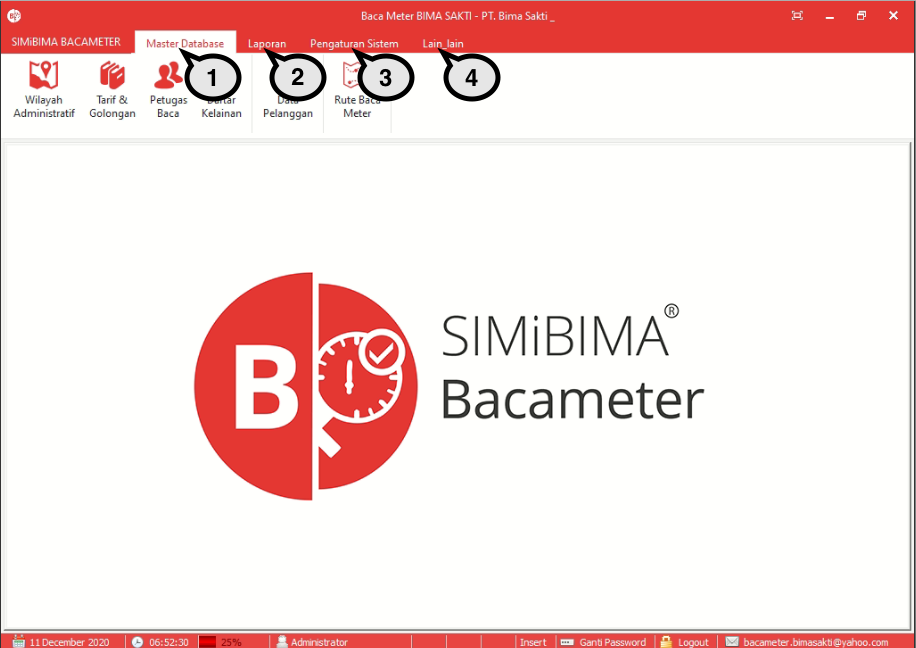

= Menu Modul Sistem Kontrol

== Menu Sistem Kontrol

1. Menu *Master Data* digunakan untuk menampilkan dapat digunakan oleh User untuk melihat dan mengakses fitur-fitur utama yang ada di dalam modul Bacameter.
2. Menu *Laporan* dapat digunakan oleh User untuk melakukan proses reporting atau pelaporan dari data yang ada di modul Bacameter.
3. Menu *Pengaturan Sistem* adalah menu yang dapat digunakan oleh User untuk melakukan pengaturan menu dan data yang ada dalam modul Bacameter.
4. Menu *Lain-Lain* berisi fitur untuk maintenance database dan log akses.