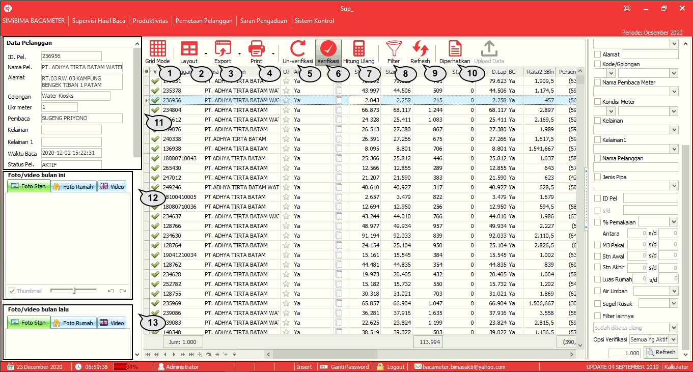
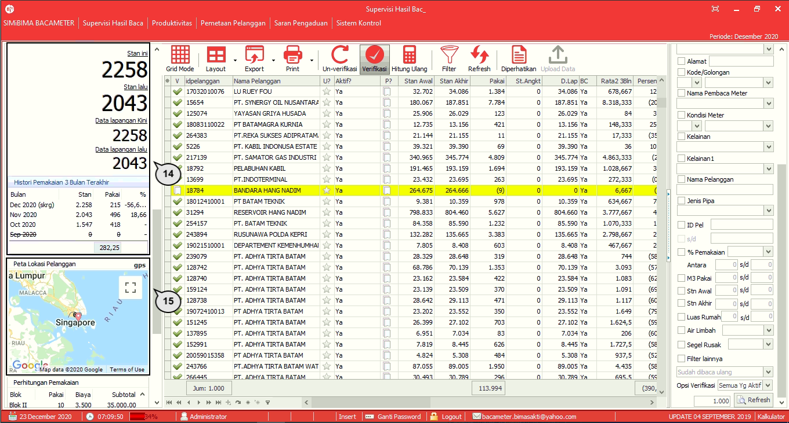
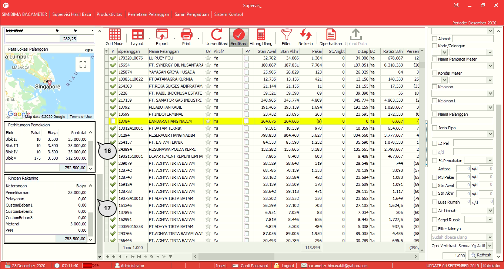

= Menu Modul Supervisi

== Menu Supervisi Hasil Baca

1. Ikon *Grid Mode* digunakan untuk menampilkan data dalam bentuk kolom dan baris (__grid__).
2. Ikon *Layout* digunakan untuk mengganti tampilan layout data yang ditampilkan.
3. Ikon *Export* digunakan untuk mengubah format data dalam bentuk Excel.
4. Ikon *Print* digunakan untuk mencetak data.
5. Ikon *Un-verifikasi* digunakan untuk membatalkan verifikasi seluruh  data yang telah diverifikasi pada grid.
6. Ikon *Verifikasi* digunakan untuk melakukan verifikasi seluruh data yang ada pada __grid__.
7. Ikon *Hitung Ulang* digunakan untuk menghitung ulang rekening pelanggan jika terjadi perubahan parameter penghitungan rekening misalnya tarif progresif. Sedangkan sebelumnya data pembacaan telah diunggah.
8. Ikon *Filter* digunakan untuk menyaring data sesuai dengan kondisi yang diinginkan.
9. Ikon *Refresh* digunakan untuk menyegarkan kembali halaman supervisi hasil baca.
10. Ikon *Diperhatikan* digunakan untuk menampilkan data sesuai dengan perintah tertentu. Disesuaikan data yang ditampilkan PDAM dengan kondisi yang harus diperhatikan oleh admin verifikator untuk memverifikasi hasil bacaan.
11. __Sidebar__ *Data Pelanggan* igunakan untuk menampilkan detail data pelanggan.
12. __Sidebar__ *Foto/video bulan ini* digunakan untuk menampilkan foto angka stan meter atau foto dengan kelainan tertentu pada periode bulan ini/bulan berjalan.
13. __Sidebar__ *Foto/video bulan lalu* digunakan untuk menampilkan foto angka stan meter atau foto dengan kelainan tertentu pada periode bulan lalu/bulan sebelumnya.
+

14. *History Pemakaian 3 Bulan Terakhir* digunakan untuk menampilkan riwayat pemakaian PDAM oleh pelanggan selama 3 bulan terakhir.
15. *Peta Lokasi Pelanggan* digunakan untuk menampilkan alamat lokasi pelanggan PDAM Bangli.
+

16. *Perhitungan Pemakaian* digunakan untuk menampilkan hitungan tarif per blok pemakaian sesuai golongan pelanggan.
17. *Rincian Rekening* digunakan untuk menampilkan rincian perhitungan pemakaian pelanggan selama 1 bulan.

