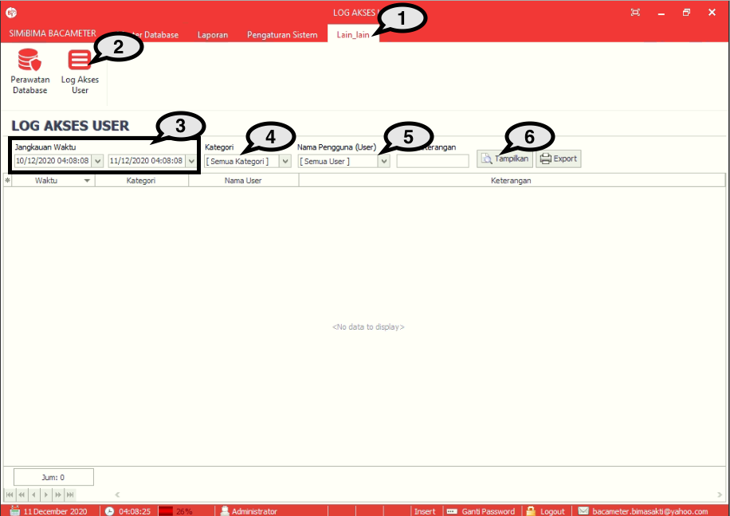
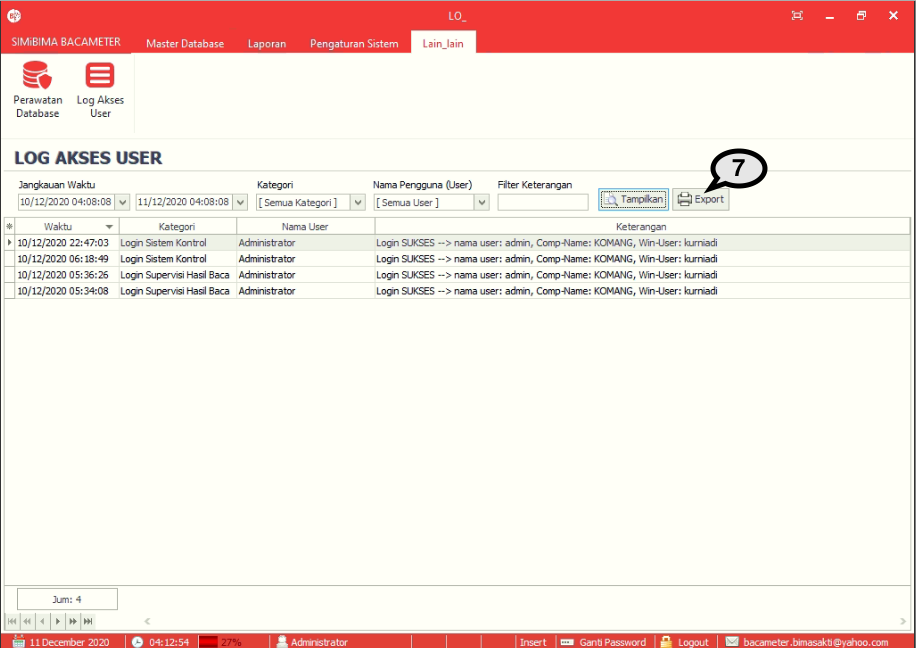

= Menampilkan Log User Akses

Fitur ini berfungsi untuk melihat data log aktivitas yang dilakukan oleh User. Berikut merupakan langkah-langkah yang dapat diikuti.

1. Pilih menu *Lain-Lain*
2. Cari ikon *Log Aktivitas User*
3. Pilih jangka waktu aktivitas User yang ingin ditampilkan
4. Pilih kategori aktivitas yang ingin ditampilkan
5. Pilih nama pengguna/User akses dari pengguna
6. Tekan tombol *Tampilkan* untuk menampilkan aktivitas User berdasarkan jangka waktu dan kategori aktivitas yang sudah dimasukkan sebelumnya. Jika terdapat aktivitas yang dilakukan oleh User tersebut, akan muncul secara otomatis pada tabel aktivitas seperti gambar di bawah ini. 
+

7. Tekan tombol *Export* untuk mencetak hasil data Log User Akses.