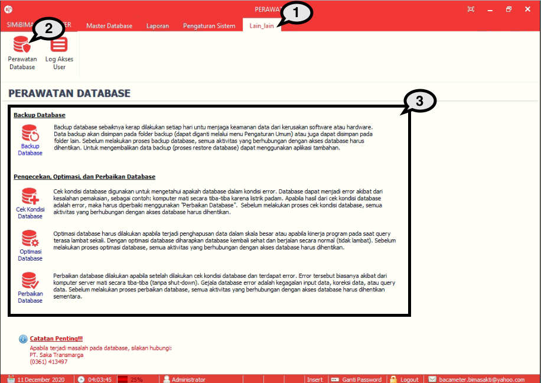
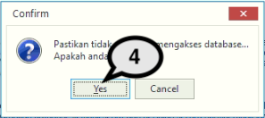
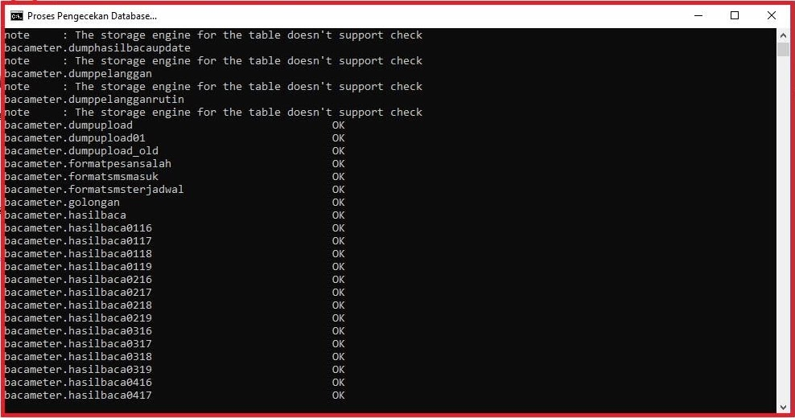

= Mengelola Database

Fitur ini berfungsi untuk melakukan pengelolaan _maintenance_ pada _database_. Berikut merupakan langkah-langkah yang dapat diikuti.

1. Pilih menu *Lain-Lain*
2. Cari ikon *Perawatan Database* seperti yang ditunjukkan oleh angka 2 pada gambar di atas
3. Pilih perawatan _database_ yang ingin dilakukan, baik itu _backup database_, cek kondisi _database_, optimasi _database_, maupun perbaikan _database_. Berikut contoh dari perawatan *Cek Kondisi Database*
+ 

4. Selanjutnya akan muncul _pop up_ konfirmasi. Jika ingin melanjutkan proses pengecekan _database_, tekan tombol *Yes*. Selanjutnya, tunggu sampai proses pengecekan selesai, seperti gambar di bawah ini.
+ 
