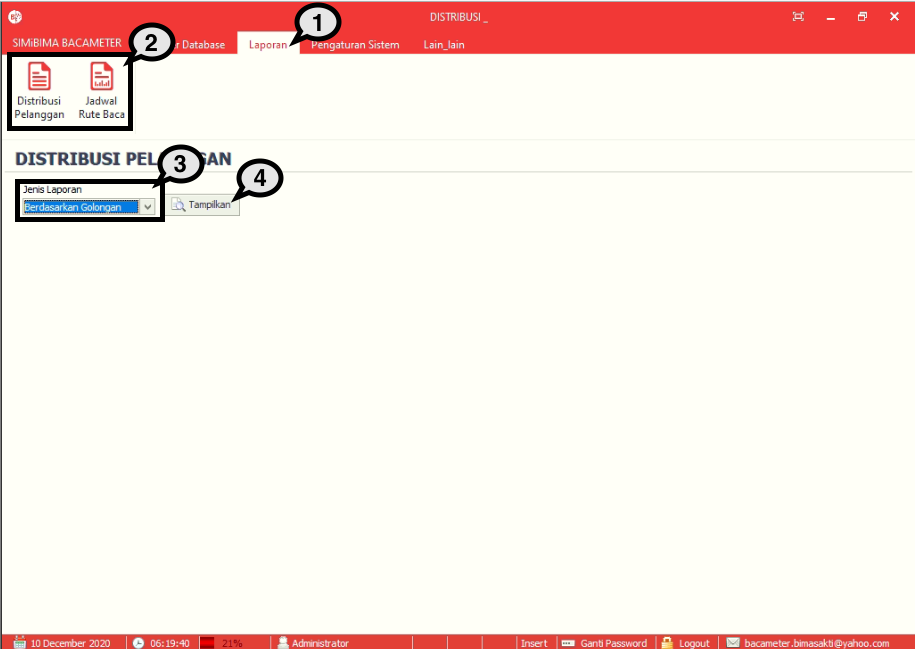
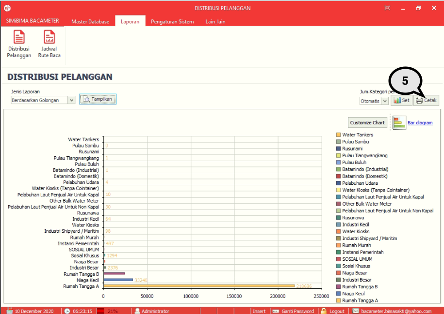

= Menampilkan Laporan

Fitur ini berfungsi untuk menampilkan laporan atau report yang meliputi Distribusi Pelanggan dan Jadwal Rute Baca. Anda dapat mengikuti langkah berikut untuk menampilkan laporan tersebut:

1. Pilih menu *Laporan*
2. Selanjutnya, pilih *Kategori Laporan* yang ingin ditampilkan. Dalam proses ini, diambil contoh Laporan Distribusi Pelanggan
3. Pilih *Jenis Laporan* yang ingin ditampilkan dengan klik pada dropdown seperti poin 3 pada gambar di atas
4. Tekan tombol *Tampilkan*
+

5. Sistem akan menampilkan laporan. Anda dapat mencetaknya dengan cara menekankan tombol *Cetak* seperti poin 5 pada gambar di atas.