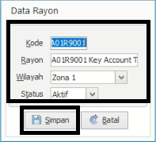

= Menambah, Memperbarui, dan Menghapus Master Data

1. Pilih menu *Master Database*
2. Cari ikon *Wilayah Administratif*
3. Klik kanan pada _mouse_ pada tabel rayon untuk menambahkan data wilayah administratif baru. Pilih ikon *tambah* seperti poin 3 pada gambar di atas. Contoh yang digunakan, yaitu menambahkan *Data Rayon*. Selanjutnya lengkapi form *Data Rayon*. Jika sudah, tekan tombol *Simpan* untuk menambah data rayon seperti gambar di bawah ini
+

4. Pilih data yang ingin diubah, lalu klik kanan pada _mouse_. Selanjutnya tekan ikon *Koreksi* seperti poin 4 pada gambar utama di atas. Perbarui bagian yang ingin diubah. Jika sudah, tekan tombol *Simpan* untuk memperbarui data seperti gambar di bawah ini
+

5. Pilih data yang ingin dihapus, lalu klik kanan pada _mouse_. Tekan ikon *Hapus* seperti poin 5 pada gambar utama di atas. Selanjutnya, akan muncul _pop up_ konfirmasi seperti gambar di bawah ini. Jika yakin untuk menghapus data rayon tersebut, tekan tombol *Yes*
+
