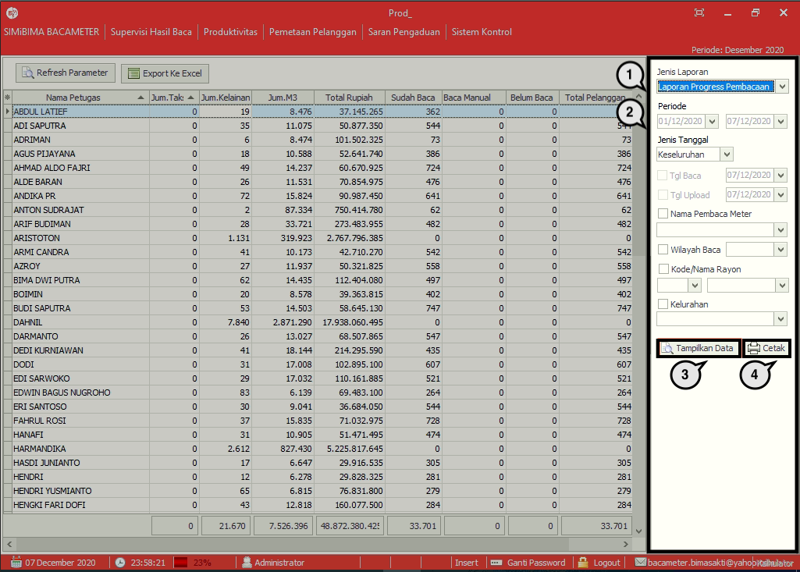

= Pemetaan Pelanggan

Menu *Pemetaan Pelanggan* menampilkan penyebaran pelanggan berdasarkan hasil pembacaan oleh petugas baca meter. Data tersebut diambil dari GPS yang diaktifkan pada saat pembacaan. Namun, pemetaan ini dapat berjalan jika terdapat koneksi internet pada _server_ Bimasakti untuk mengambil data peta. Ikuti langkah di bawah ini untuk menggunakan menu.

1. Untuk menampilkan pemetaan pelanggan terlebih dahulu pilih _filter_ yang akan digunakan
2. Setelah itu tekan *Tampilkan Data*
3. Untuk meng-_export file_, klik *Toolbar Export* 
4. Pilih tempat penyimpanan _file_
5. Beri nama _file_, lalu tekan *OK*.