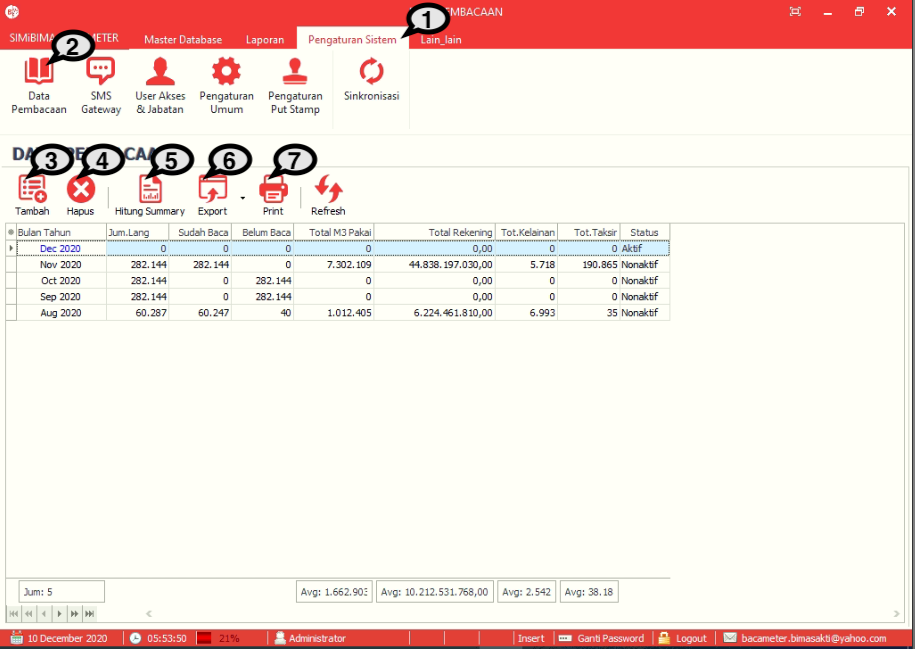
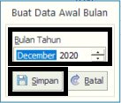
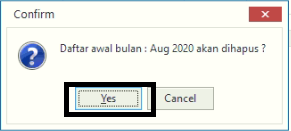
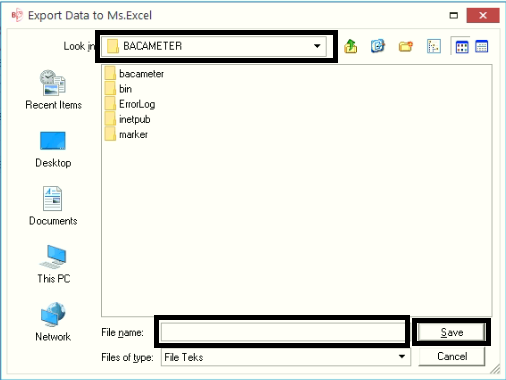
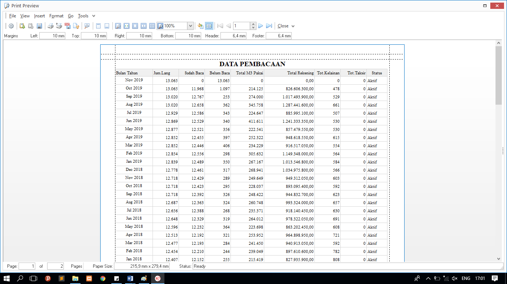

= Mengelola Data Pembacaan

Fitur ini berfungsi untuk mengelola pembacaan data, baik itu menambahkan data pembacaan setiap bulanya, menghapus, menghitung jumlah hasil bacaan, dan mencetak laporan untuk membuat periode pembacaan pada Bacameter seperti langkah berikut.

1. Pilih menu *Pengaturan Sistem*
2. Cari ikon *Data Pembacaan*
3. Tekan ikon *Tambah* seperti poin 3 pada gambar di atas untuk pembuatan data pembacaan awal bulan. Selanjutnya, pilih bulan dan tahun yang ingin dibuat. Jika sudah, tekan tombol *Simpan* seperti gambar di bawah ini
+

4. Pilih data hasil baca yang ingin dihapus. Tekan ikon *Hapus* seperti poin 4 pada gambar utama di atas. Selanjutnya akan muncul _pop up_ konfirmasi.  Jika yakin untuk menghapus akses User, tekan tombol *Yes*
+

5. Tekan ikon *Hitung Summary* untuk menghitung hasil bacaan. Tunggu hingga proses penghitungan hasil baca selesai
6. Daftar Hasil Bacaan dapat disimpan ke dalam format HTML, Excel, XML, dan txt dengan menekan ikon *Export* seperti poin 6 pada gambar utama di atas. Tentukan tempat penyimpanan dan nama _file_. Jika sudah, tekan tombol *Save* untuk mengekspor data
+

7. Tekan tombol *Print* untuk mencetak daftar data pembacaan, seperti poin 7 pada gambar utama di atas. Berikut contoh halaman cetak Data Pembacaan.
+
