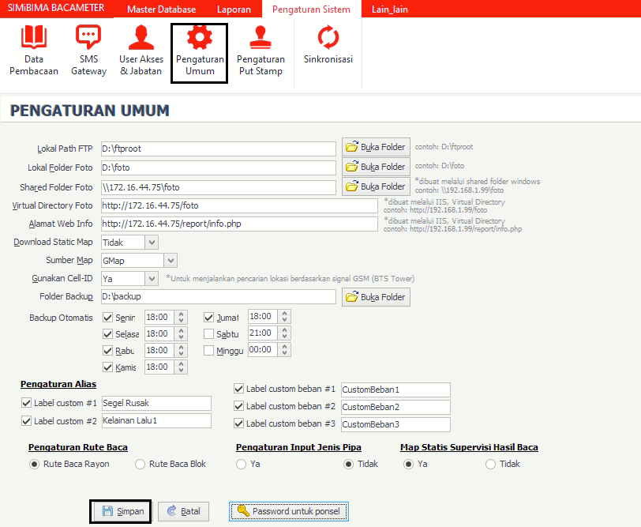

= Pengaturan Umum

Fitur ini digunakan untuk melakukan pengaturan secara general pada sistem. Untuk melakukan pengaturan sistem bisa dengan mengubah atau mengisi form yang tersedia, kemudian klik tombol *Simpan*.