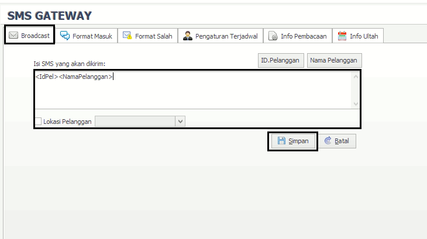
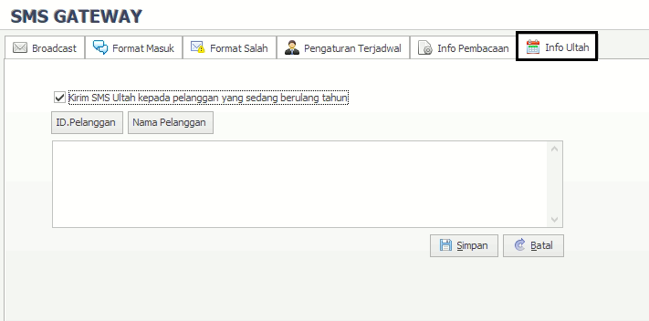

= SMS Gateway

Fitur SMS Gateway berfungsi untuk mengelola SMS untuk pelanggan. Di dalam fitur ini tersedia menu yaitu *Broadcast, Format masuk, Format Salah, Pengaturan Terjadwal, Info Pembacaan* dan *Info Ultah*. Berikut untuk detail menu yang ada di dalam *SMS Gateway:*

.*Broadcast*
[%collapsible]
====

Menu Broadcast digunakan untuk mengisi isi SMS dan mengirimkan ke pelanggan. Untuk mengisi format SMS bisa mengisi sesuai form yang tersedia, data yang harus diinputkan adalah ID Pelanggan, Nama Pelanggan, Isi SMS, Lokasi Pelanggan. Setelah mengisi sesuai dengan form yang dipilih, klik tombol Simpan.
====

.*Format Masuk*
[%collapsible]
====
Menu *Format Masuk* digunakan untuk melakukan pengaturan format SMS balasan yang masuk ke dalam sistem. Ada 5 fitur yang ada di dalam menu format masuk yaitu *Non/Aktif, Koreksi, Export, Print* dan *Refresh*. Berikut untuk detail menu dari format masuk :

1. Menu *Non/Aktif* digunakan untuk mengaktifkan atau menonaktifkan format pesan masuk sesuai dengan data yang dipilih
2. Menu *Koreksi* digunakan untuk mengoreksi (*edit*) format pesan masuk sesuai dengan data yang dipilih
3. Menu *Export* digunakan untuk _export file list_ data format pesan masuk berupa _file_ HTML, Excel, XML, File Teks.
4. Menu *Print* digunakan untuk mencetak _list_ data Format Masuk.
5. Menu *Refresh* digunakan untuk _merefresh_ _list_ data Format Masuk.
====

.*Format Salah*
[%collapsible]
====
Menu Format Salah digunakan untuk melakukan pengaturan format SMS balasan ketika pelanggan melakukan kesalahan format sms. Ada 4 fitur yang ada di dalam menu format salah yaitu *Koreksi, Export, Print* dan *Refresh*. Berikut untuk detail menu dari format salah : 

1. Menu *Koreksi* digunakan untuk mengoreksi (*edit*) format pesan salah
2. Menu *Export* digunakan untuk _export file list_ data format pesan salah berupa _file_ HTML, Excel, XML, File Teks.
3. Menu *Print* digunakan untuk mencetak _list_ data Format Salah.
4. Menu *Refresh* digunakan untuk _merefresh_ _list_ data Format Salah.
====

.*Pengaturan Jadwal*
[%collapsible]
====
Menu *Pengaturan Jadwal* digunakan untuk melakukan pengaturan Jadwal SMS yang akan dikirimkan ke pelanggan. Ada 5 fitur yang ada di dalam menu format salah yaitu *Tambah, Koreksi, Hapus, Export, Print* dan *Refresh*. Berikut untuk detail menu dari Pengaturan Jadwal :

image::../images-bacameter/bacameter-jadwal-bacameter.png[align="center"]

1. Menu *Tambah* digunakan untuk menambah jadwal SMS baru yang akan dikirim ke pelanggan
+

+
- Untuk menambah jadwal baru, silahkan mengisi form yang sudah ditentukan mulai dari format sms, nomor tujuan dan detail jadwal. Kemudian klik tombol Simpan untuk menambah data.
2. Menu *Koreksi* digunakan untuk mengoreksi (edit) pada data  Pengaturan Jadwal yang dipilih
3. Menu *Export* digunakan untuk _export file list_ data Pengaturan Jadwal salah berupa _file_ HTML, Excel, XML, File Teks.
4. Menu *Print* digunakan untuk mencetak list data Pengaturan Jadwal
5. Menu *Refresh* digunakan untuk merefresh list data Pengaturan Jadwal.
====

.*Info Pembacaan*
[%collapsible]
====

image::../images-bacameter/bacameter-jadwal-bacameter.png[align="center"]

Menu *Info Pembacaan* digunakan untuk pengaturan SMS tagihan kepada pelanggan. Untuk menambah info pembacaan yaitu dengan mengisi form yang sudah ditentukan kemudian klik tombol *Simpan*.
====

.*Info Pembacaan*
[%collapsible]
====

image::../images-bacameter/bacameter-jadwal-bacameter.png[align="center"]

Menu *Info Pembacaan* digunakan untuk pengaturan SMS tagihan kepada pelanggan. Untuk menambah info pembacaan yaitu dengan mengisi form yang sudah ditentukan kemudian klik tombol *Simpan*.
====

.*Info Ultah*
[%collapsible]
====

Menu *Info Ultah* digunakan untuk pengaturan dan mengirim SMS ke pelanggan yang berulang tahun. Untuk mengirim Sms ke pelanggan yang ulang tahun yaitu mengisi form yang tersedia dengan mengisikan ID Pelanggan dan Nama Pelanggan. Kemudian Klik tombol *Simpan*
====