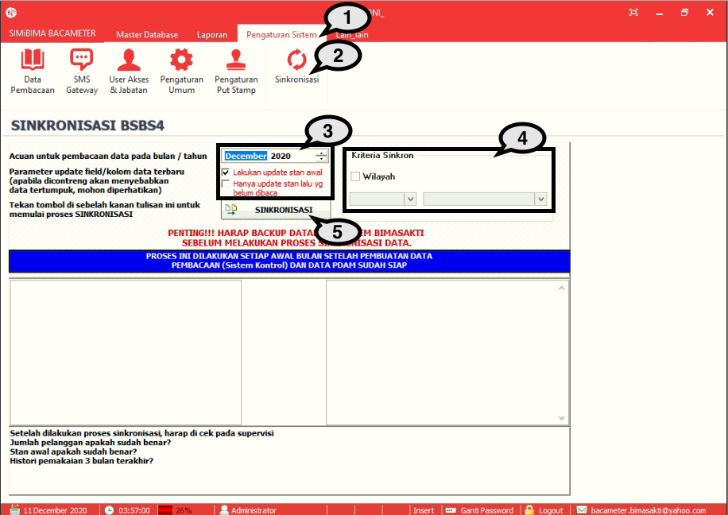

= Sinkronisasi Data

Fitur ini berfungsi untuk melakukan proses sinkronisasi atau proses menyamakan data yang ada pada data billing (aplikasi BSBS) dengan data Bacameter. Berikut adalah langkah-langkahnya : 

1. Pilih menu *Pengaturan Sistem*
2. Cari ikon *Sinkronisasi*
3. Pilih *bulan acuan* untuk melakukan sinkronisasi. Jika ingin melakukan update stan awal/hanya update stan sebelumnya yang belum dibaca, berikan tanda *centang*
4. Pilih *Kriteria Sinkron Wilayah* jika diperlukan
Tekan tombol *Sinkronisasi* untuk memulai sinkronisasi  seperti yang ditunjukkan oleh angka 5 pada gambar di atas