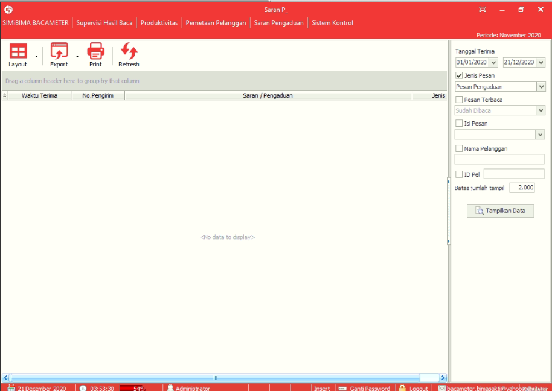

= Menampilkan Saran dan Pengaduan

Menu *Saran dan Pengaduan* menampilkan saran maupun pengaduan masyarakat yang disampaikan melalui SMS _gateway server_ Bimasakti. Setiap SMS masyarakat dengan format saran secara otomatis akan masuk ke menu ini.  Ikuti langkah di bawah ini untuk menggunakan menu.

1. Untuk Menampilkan data saran dan pengaduan yang masuk dengan memilih dahulu _filter_ yang ingin ditentukan
2. Klik *Tampilkan Data* 
3. User dapat menandai Saran dan Pengaduan yang masuk menjadi telah dibaca, caranya dengan klik kanan pada saran yang tampil
4. Pilih tandai telah dibaca
5. Untuk menyimpan, klik *Toolbar Export*
6. Untuk mencetak, klik *Toolbar Cetak*.

Pada bagian bawah tabel terdapat beberapa menu yang memungkinkan kita untuk mengetahui serta melakukan beberapa hal, di antaranya.

1. Menunjukan *Tanggal* saat itu
2. Menunjukan *Waktu* saat itu dengan format waktu hh:mm:ss
3. Menunjukan *Jumlah Memory PC* yang tersisa dalam bentuk persentase
4. Menunjukkan *akses User* yang digunakan saat login
5. Mengganti *Password User*
6. Untuk *Logout* dari aplikasi
7. Mengirimkan saran, pertanyaan, keluhan kepada Bimasakti via email
