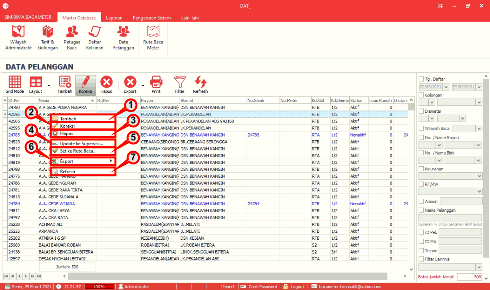

= Mengelola Data Pelanggan dari Data  Daftar Pelanggan

1. *Tambah* digunakan untuk menambah data daftar pelanggan.
2. *Koreksi* digunakan untuk mengubah data daftar pelanggan.
3. *Hapus* digunakan untuk menghapus data daftar pelanggan.
4. *Update ke Supervisi* digunakan untuk meng-_update_ ke supervisi.
5. *Set ke Rute baca* digunakan untuk menambahkan pelanggan ke rute pembacaan.
6. *Export* digunakan untuk _export_ kedalam bentuk HTML, Exel, Exel 2007, XML, File Teks.
7. *Refresh* digunakan untuk menyegarkan halaman data daftar pelanggan.
