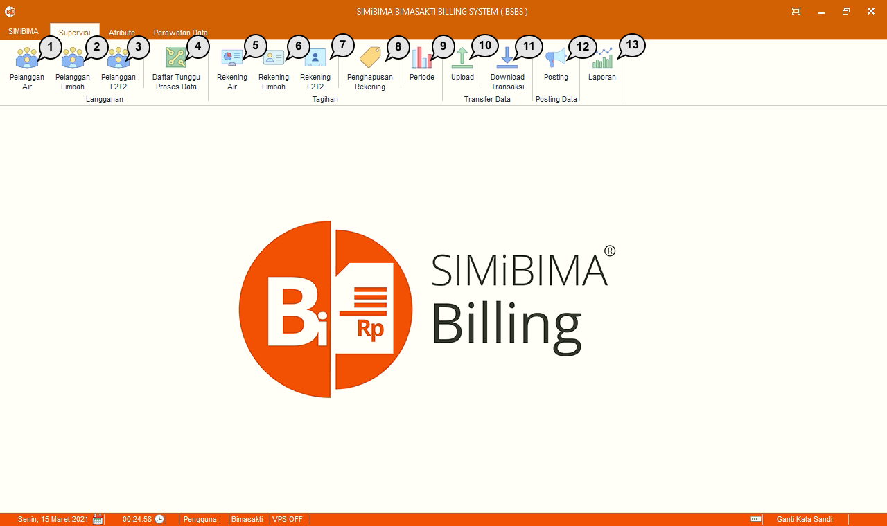

= Menu Modul Billing

Terdapat 3 menu dalam Modul Billing, yaitu:

1. Menu Supervisi
+
.Detail Menu Supervisi
[%collapsible]
====

1. Ikon *Pelanggan Air* menyediakan data pelanggan khusus air dari PDAM, serta menyediakan menu untuk memanipulasi data pelanggan.
2. Ikon *Pelanggan Limbah* menyediakan data pelanggan khusus limbah dari PDAM.
3. Ikon *Pelanggan L2T2* menyediakan data pelanggan khusus limbah tinja dari PDAM.
4. Ikon *Daftar Tunggu Proses Data* menyediakan menu yang digunakan untuk melakukan verifikasi Koreksi Rekening.
5. Ikon *Rekening Air* menyediakan menu untuk mengolah data rekening air di setiap periode atau bulan.
6. Ikon *Rekening Limbah* menyediakan menu untuk mengolah data rekening limbah di setiap periode atau bulan.
7. Ikon *Rekening L2T2* menyediakan menu untuk mengolah data rekening limbah tinja di setiap periode atau bulan.
8. Ikon *Penghapusan Rekening* menyediakan menu dengan fungsi utama untuk menghapus rekening yang terdaftar. Namun, dalam menu ini _User_ juga dapat melakukan _refresh_ data, menambah rekening, _export_, validasi, hingga _print_ data.
9. Ikon *Periode* menyediakan fasilitas untuk membuat periode rekening air per bulannya berdasarkan pelanggan aktif pada saat itu dan menyediakan fasilitas untuk buka dan tutup periode rekening air. Jika periode tertutup, maka manipulasi data rekening pada periode tersebut tidak bisa dilaksanakan. Manipulasi hanya bisa dilaksanakan ketika periode terbuka.
10. Ikon *Upload* menyediakan fasilitas untuk mengunggah data rekening air ke VPS atau Cloud Server dan data parameter lainnya (pelanggan, golongan atau tarif, loket bayar, _User_ loket dan BSHPD).
11. Ikon *Download* Transaksi untuk mengunduh semua transaksi air dari VPS atau Cloud Server ke _database_ lokal.
12. Ikon *Posting* menyediakan fasilitas untuk mengunci DRD di setiap bulannya. Menu ini digunakan ketika DRD sudah resmi dan disetujui oleh Direktur untuk diterbitkan sebagai tagihan rekening.
13. Ikon *Laporan* menyediakan menu untuk mencetak laporan setiap bulannya (Posisi Pelanggan, DRD, penerimaan, piutang, efektifitas, efisiensi).
====

2. Menu Attribute
+
.Detail Menu Attribute
[%collapsible]
====

1. Ikon *Tarif* menyediakan menu untuk memanipulasi, menambah, atau mengubah data tarif.
2. Ikon *Area Wilayah* menyediakan menu untuk memanipulasi, menambah, atau mengubah data wilayah dan area pelanggan PDAM.
3. Ikon *Loket* menyediakan menu untuk memanipulasi, menambah, atau mengubah data loket pembayaran PDAM.
4. Ikon *Merek Meter* menyediakan menu untuk memanipulasi, menambah, atau mengubah data meteran air, limbah, L2T2.
5. Ikon *Sumber Air* menyediakan menu untuk memanipulasi, menambah, atau mengubah data sumber air.
6. Ikon *Kolektif* menyediakan menu untuk memanipulasi, menambah, atau mengubah data kolektif pelanggan.
7. Ikon *Kepemilikan* menyediakan menu untuk memanipulasi, menambah, atau mengubah data kepemilikan.
8. Ikon *Paraf* menyediakan menu untuk memanipulasi, menambah, atau mengubah data paraf (tanda tangan) yang digunakan pada masing masing laporan bagian bawah.
9. Ikon *Pengguna BSBS* menyediakan menu untuk memanipulasi, menambah, atau mengubah data pengguna atau User aplikasi BSBS.
10. Ikon *Pengguna Loket & BSHL* menyediakan menu untuk memanipulasi, menambah, atau mengubah data pengguna atau _User_ pada aplikasi Loket dan BSHPD.
====

3. Menu Perawatan Data
+
.Detail Menu Perawatan Data
[%collapsible]
====

1. Ikon *Backup DB* Pusat digunakan untuk mencadangkan _database_ BSBS.
2. Ikon *Repair DB* Pusat digunakan untuk memperbaiki _database_ BSBS.
3. Ikon *Backup DB Unit / Loket* digunakan untuk mencadangkan _database_ Loket dan BSHPD.
4. Ikon *Repair DB Unit / Loket* digunakan untuk memperbaiki _database_ Loket dan BSHPD.