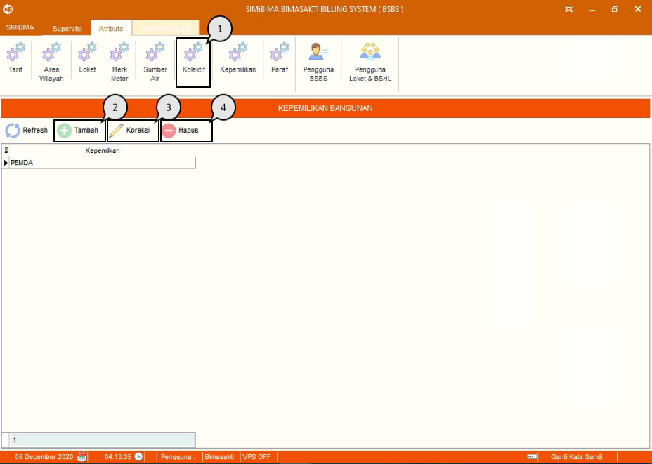
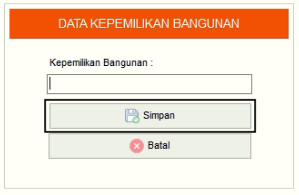
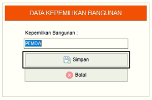
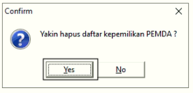

= Menambah, Mengubah, dan Menghapus Data Kepemilikan

Fitur ini berfungsi untuk mengelola data kepemilikan, baik itu menambahkan, memperbarui maupun menghapus data seperti langkah di bawah ini.

1. Pilih menu *Atribut*, cari ikon *Kepemilikan*
2. Tekan ikon *Tambah* seperti poin 3 pada gambar di atas untuk menambahkan data kepemilikan. Selanjutnya isi _form_ data kepemilikan. Jika sudah, tekan tombol *Simpan* seperti pada gambar di bawah ini
+

3. Pilih data yang ingin diubah terlebih dahulu. Selanjutnya tekan ikon *Koreksi*, lalu perbarui bagian yang ingin diubah. Jika sudah, tekan tombol *Simpan* seperti gambar di bawah ini
+

4. Pilih data yang ingin dihapus terlebih dahulu, selanjutnya tekan ikon *Hapus*. Lalu muncul _pop-up_ konfirmasi, jika sudah yakin untuk menghapus data kepemilikan, tekan tombol *Yes*.
+

