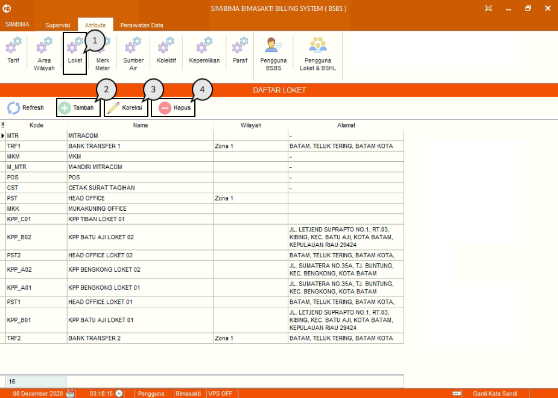
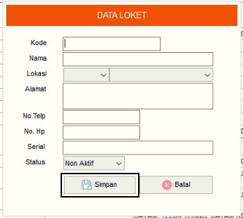
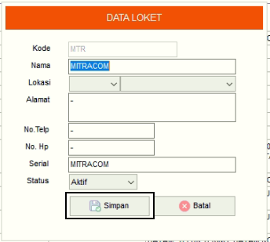
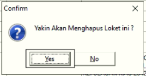

= Menambah, Mengubah, dan Menghapus Data Loket

Fitur ini berfungsi untuk memanajemen data loket, baik itu menambahkan, memperbarui maupun menghapus data seperti langkah di bawah ini.

1. Pilih menu *Atribut*, cari ikon *Loket*
2. Tekan tombol *Tambah* seperti poin 3 pada gambar di atas untuk menambahkan data. Kemudian isi _form_ data sesuai _field_ yang dibutuhkan.  Tekan tombol *Simpan* seperti pada gambar di bawah ini
+

3. Pilih data yang ingin diubah terlebih dahulu. Lalu tekan tombol *Koreksi*, perbarui bagian yang ingin diubah. Jika sudah selesai mengedit data, tekan tombol *Simpan* seperti gambar di bawah ini
+

4. Pilih data yang ingin dihapus terlebih dahulu. Selanjutnya tekan ikon *Hapus*, dan muncul _pop-up_ konfirmasi. Tekan tombol *Yes* jika sudah yakin untuk menghapus seperti gambar di bawah ini.
+

