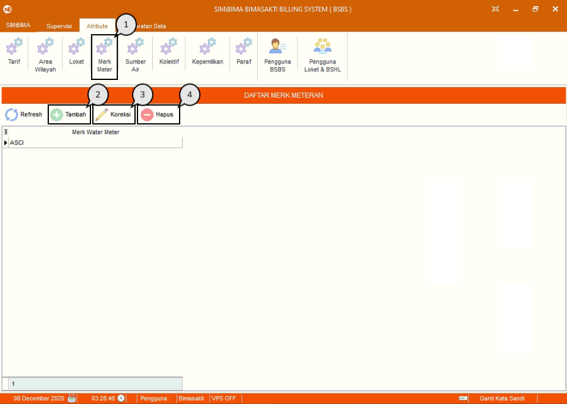
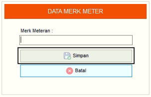
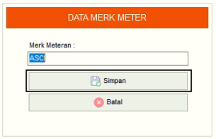
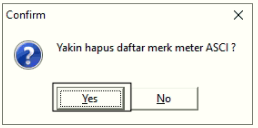

= Menambah, Mengubah, dan Menghapus Data Merek Meter

Fitur ini berfungsi untuk mengelola data merek meter, baik itu menambahkan, memperbarui maupun menghapus data seperti ikuti langkah berikut.

1. Pilih menu *Atribut*, cari ikon *Merek Meter*
2. Tekan ikon *Tambah* seperti poin 3 pada gambar di atas untuk menambahkan data merek meter. Lalu, isi _form_ data merek meter. Tekan tombol *Simpan* seperti gambar di bawah ini
+

3. Pilih data yang ingin diubah terlebih dahulu, selanjutnya tekan ikon *Koreksi*.  Perbarui bagian yang ingin diubah. Jika sudah, tekan tombol *Simpan* seperti gambar di bawah ini
+

4. Pilih data yang ingin dihapus terlebih dahulu. Tekan ikon *Hapus*, lalu akan muncul _pop-up_ konfirmasi. Jika sudah yakin untuk menghapus data merek meter, tekan tombol *Yes* seperti gambar di bawah ini
+

